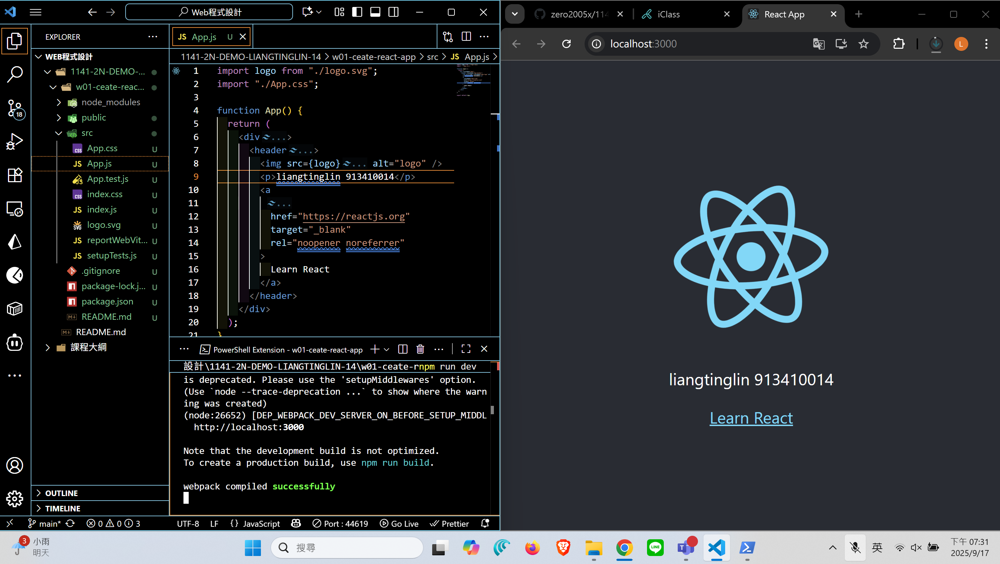
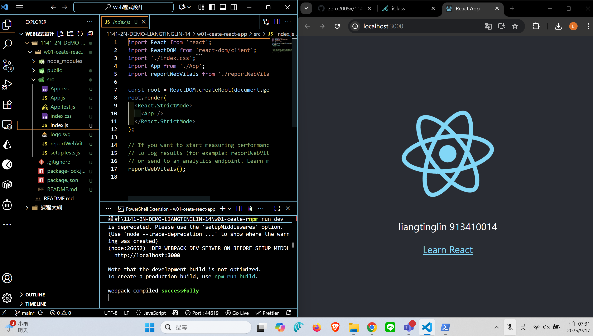
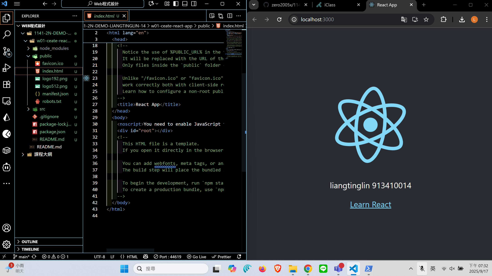
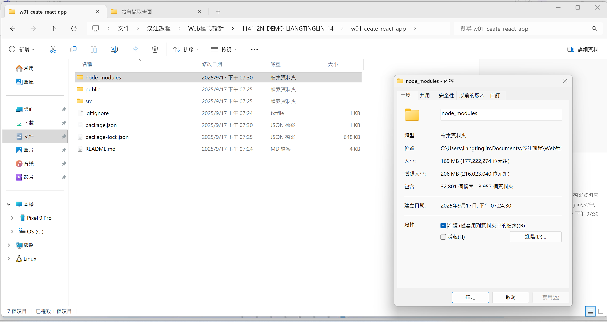
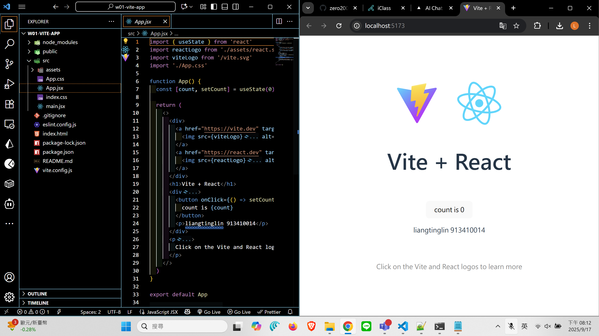
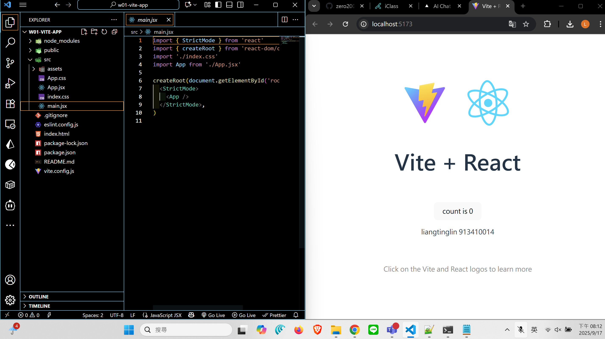
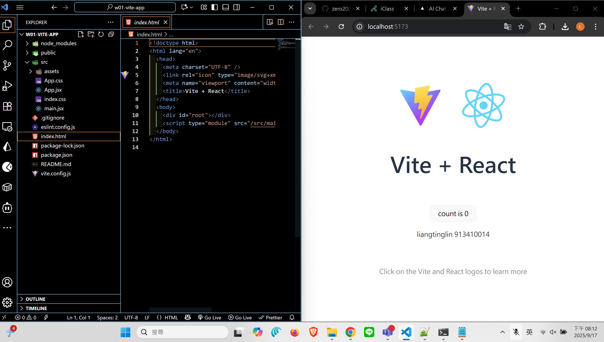
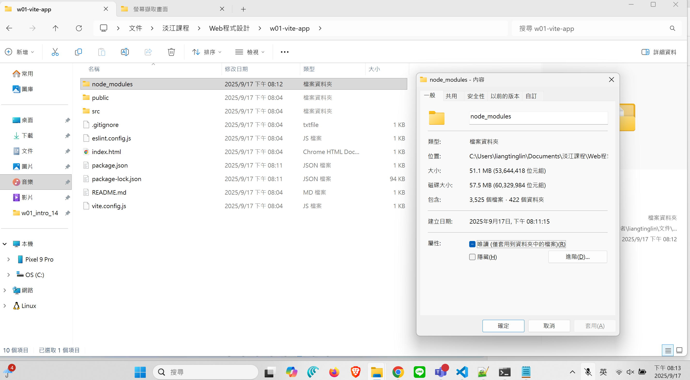
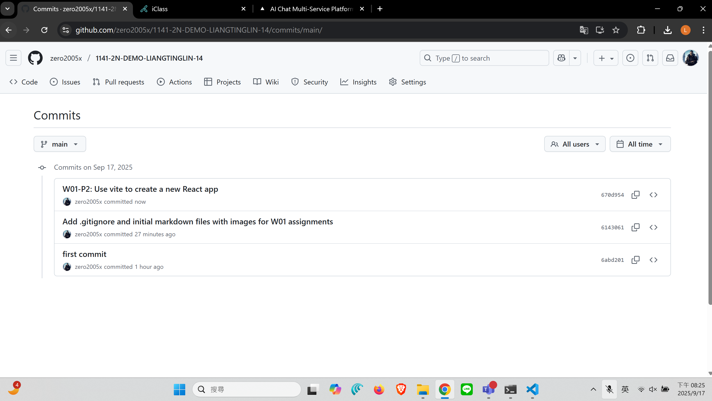
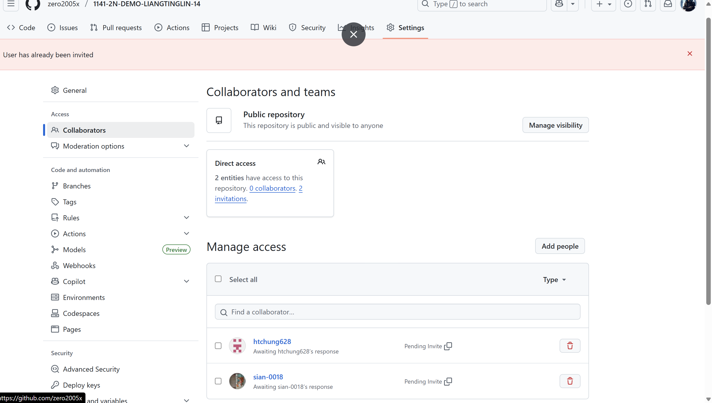

[Github URL](https://github.com/zero2005x/1141-2N-DEMO-LIANGTINGLIN-14)
[Github URL for Vercel](https://github.com/zero2005x/114_2N_demo_vercel_liangtinglin)
[Vercel URL](https://114-2-n-demo-vercel-liangtinglin.vercel.app/)

### W01-P1: Use create-react-app to create a new React app

#### => show how the index.html page being rendered







#### => share the size of node module



```
6143061 zero2005x       Wed Sep 17 19:58:02 2025 +0800  Add .gitignore and initial markdown files with images for W01 assignments
6abd201 zero2005x       Wed Sep 17 19:19:28 2025 +0800  first commit
```

### W01-P2: Use vite to create a new React app

#### => show how the index.html page being rendered







#### => share the size of node module



```
670d954 zero2005x       Wed Sep 17 20:25:08 2025 +0800  W01-P2: Use vite to create a new React app
```

### W01-logs: git logs of W01




