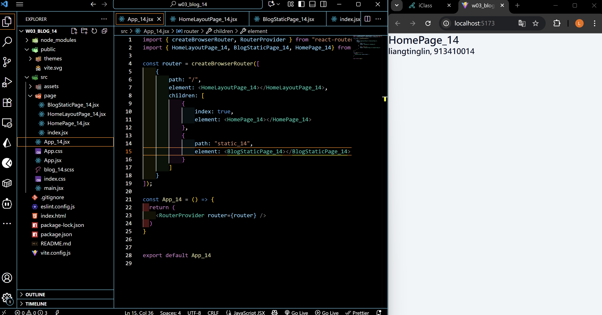
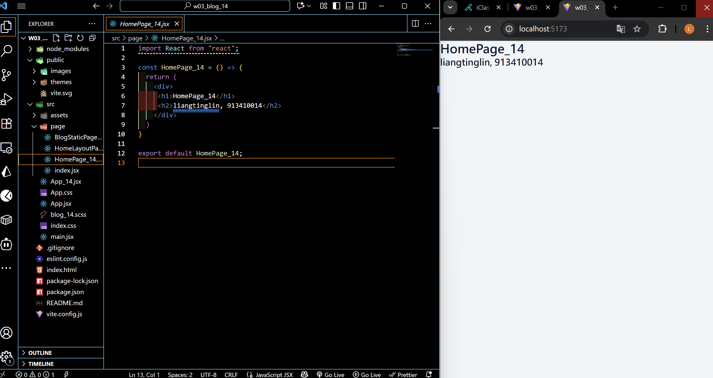
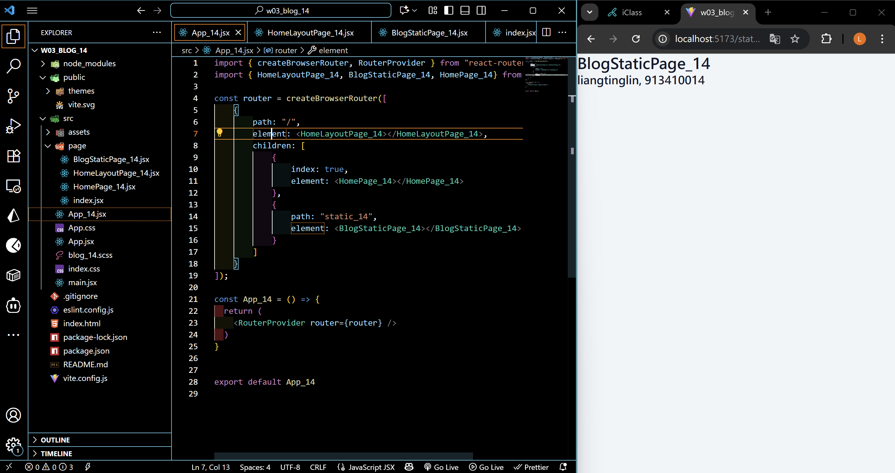
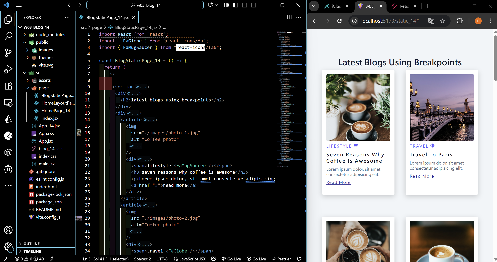
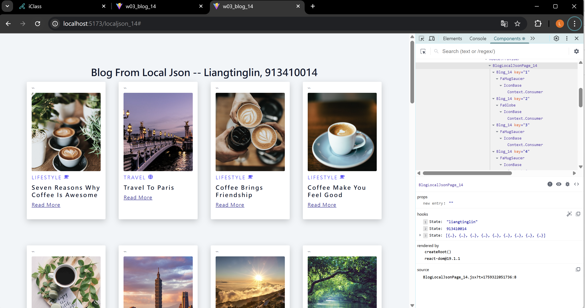
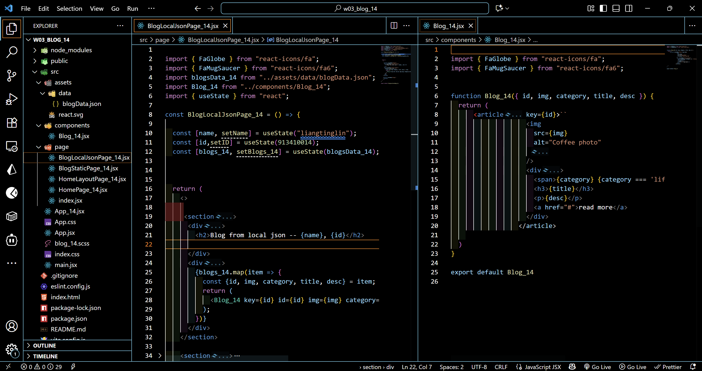
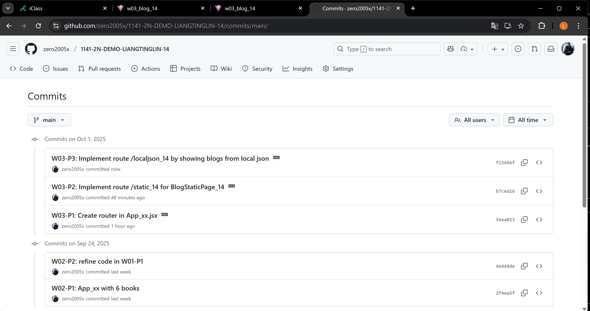

[Github URL](https://github.com/zero2005x/1141-2N-DEMO-LIANGTINGLIN-14)

### W03-P1: Create router in App_xx.jsx

#### => route / for HomePage_xx





#### => route /static_xx for BlogStaticPage_xx



```
56ea023 zero2005x       Wed Oct 1 19:25:15 2025 +0800    W03-P1: Create router in App_xx.jsx
```

### W03-P2: Implement route /static_14 for BlogStaticPage_14



```
b7cea16 zero2005x       Wed Oct 1 19:49:20 2025 +0800   W03-P2: Implement route /static_14 for BlogStaticPage_14
```

### W03-P3: Implement route /localjson_14 by showing blogs from local json

#### => Chrome demo using React DevTools



#### => code for BlogLocalJson_xx



```
f2249ef zero2005x       Wed Oct 1 20:37:16 2025 +0800   W03-P3: Implement route /localjson_14 by showing blogs from local json
```

## W03-logs: git logs of w03



```

```
