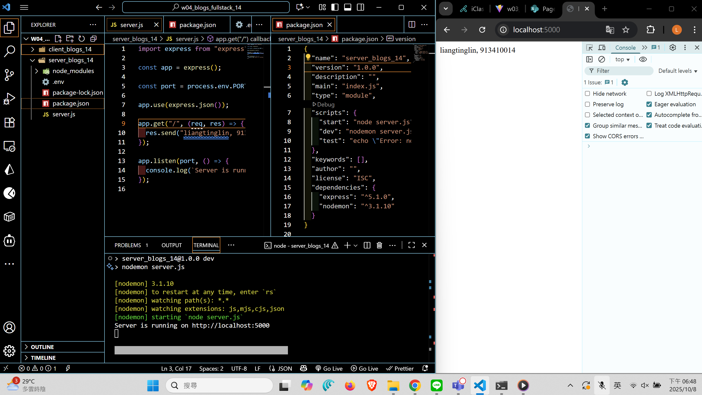
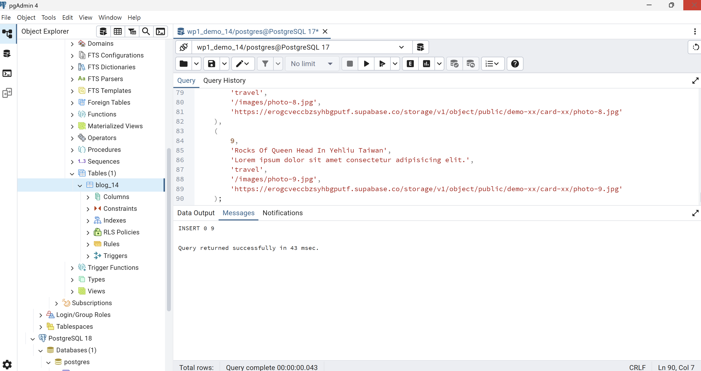
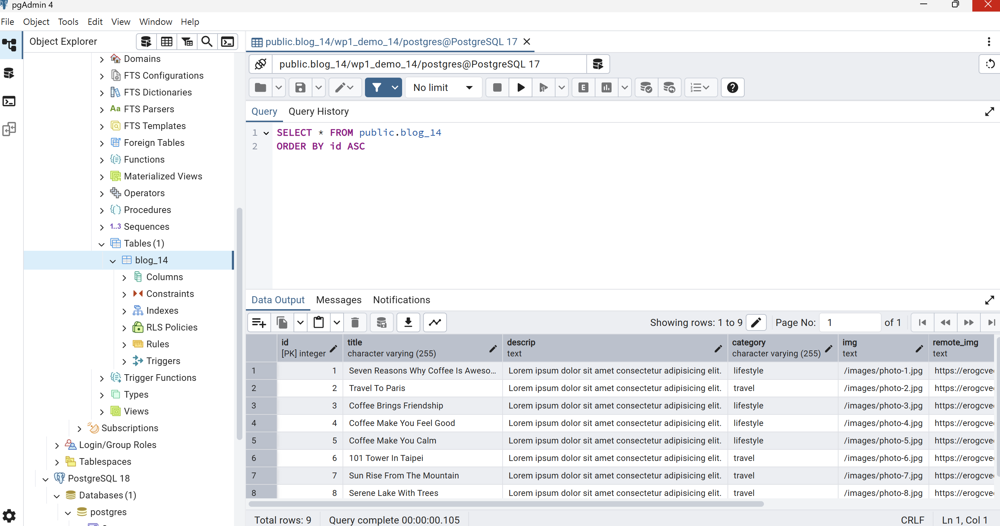
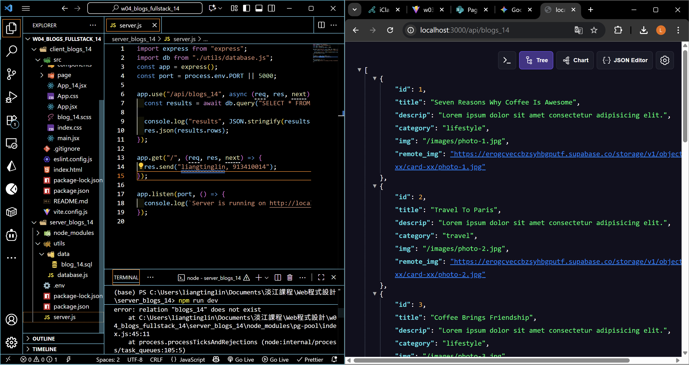
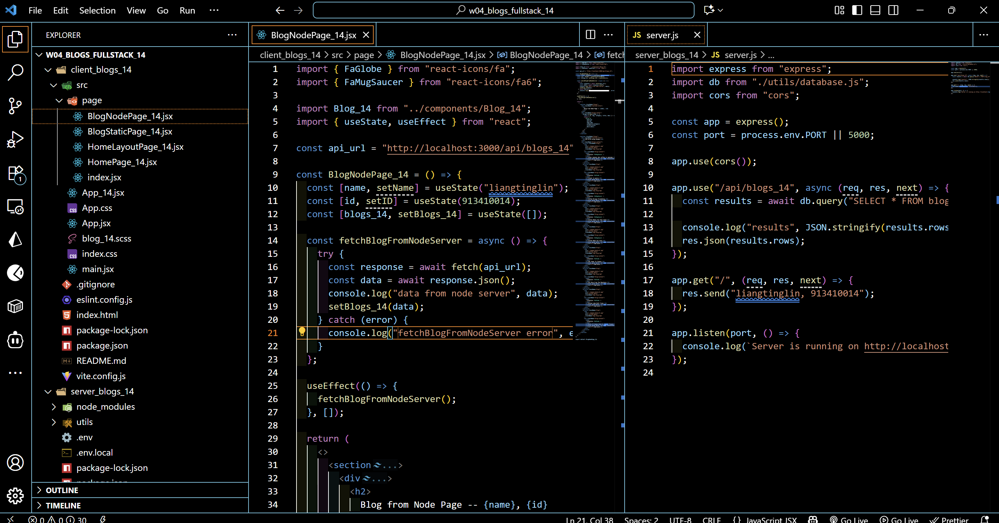
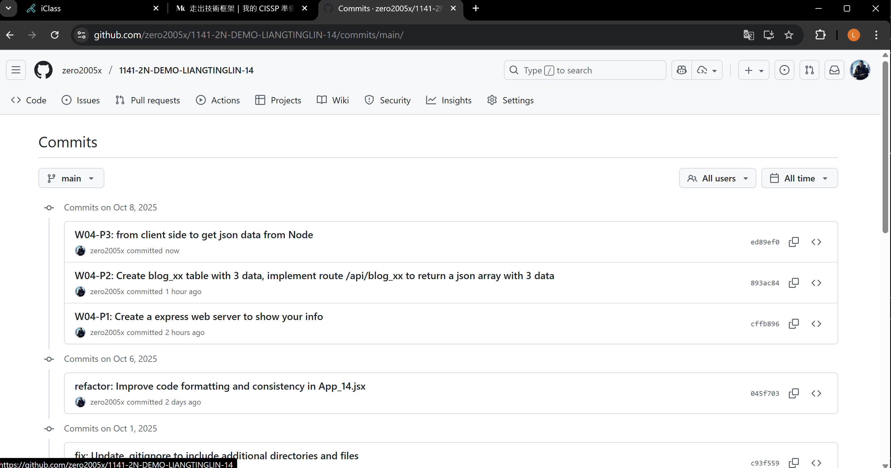

[Github URL](https://github.com/zero2005x/1141-2N-DEMO-LIANGTINGLIN-14)

### W04-P1: Create a express web server to show your info



```
cffb896 zero2005x       Wed Oct 8 18:51:20 2025 +0800   W04-P1: Create a express web server to show your info
```

### W04-P2: Create blog_xx table with 3 data, implement route /api/blog_xx to return a json array with 3 data

#### => SQL to create blog_xx table and 3 data



#### => show 3 data



#### => implement route /api/blog_xx



```

```

### W04-P3:

#### =>



```

```

## W04-logs: git logs of w04



```

```
