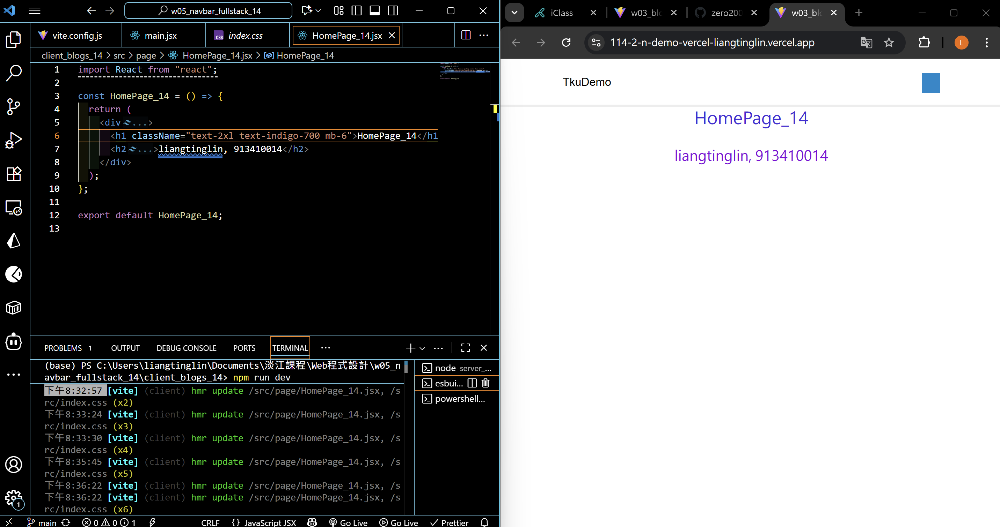

[Github URL](https://github.com/zero2005x/1141-2N-DEMO-LIANGTINGLIN-14)
[Github URL for Vercel](https://github.com/zero2005x/114_2N_demo_vercel_liangtinglin)
[Vercel URL](https://114-2-n-demo-vercel-liangtinglin.vercel.app/)

### W05-P1: Create Navbar_14 using styled components, and show BlogNodePage_14

#### => Chrome


#### => Relevant code


```
90c1f2d zero2005x       Wed Oct 15 19:19:24 2025 +0800  W05-P1: Create Navbar_14 using styled components, and show BlogNodePage_14
```

### W05-P2: Deploy to Vercel

#### => Show BlogLocalJson in Vercel


#### => Github repo with Vercel link


#### => Github demo vercel repo and Vercel URL

[Github URL for Vercel](https://github.com/zero2005x/114_2N_demo_vercel_liangtinglin)
[Vercel URL](https://114-2-n-demo-vercel-liangtinglin.vercel.app/)

```
3ae99e0 zero2005x       Wed Oct 15 19:51:00 2025 +0800  W05-P2: Deploy to Vercel
```

### W05-P3: Use tailwind css to show HomePage_14 in Vercel



```
f7f51a9 zero2005x       Wed Oct 15 20:43:33 2025 +0800  W05-P3: Use tailwind css to show HomePage_14 in Vercel
```

### W05-P4: Show BookListPage_14 using styled components


```
d3961f1 zero2005x       Wed Oct 15 21:11:05 2025 +0800  W05-P4: Show BookListPage_14 using styled components
```

## W05-logs:


```

```
