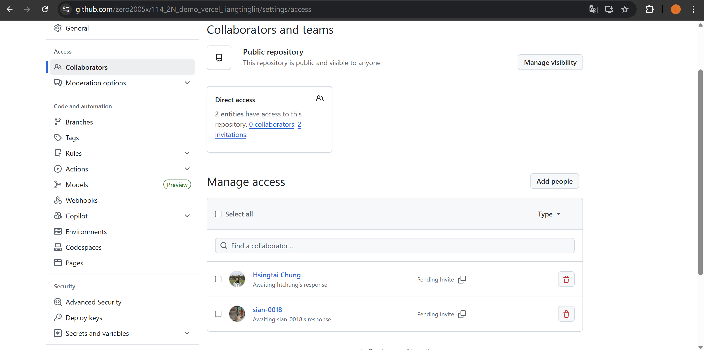
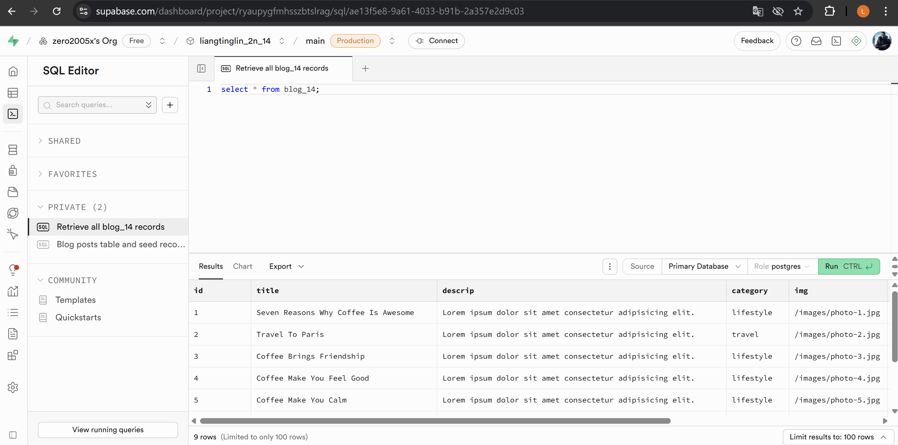
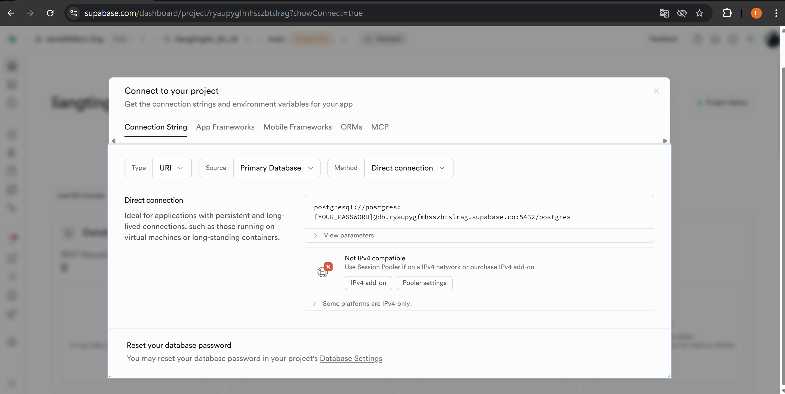
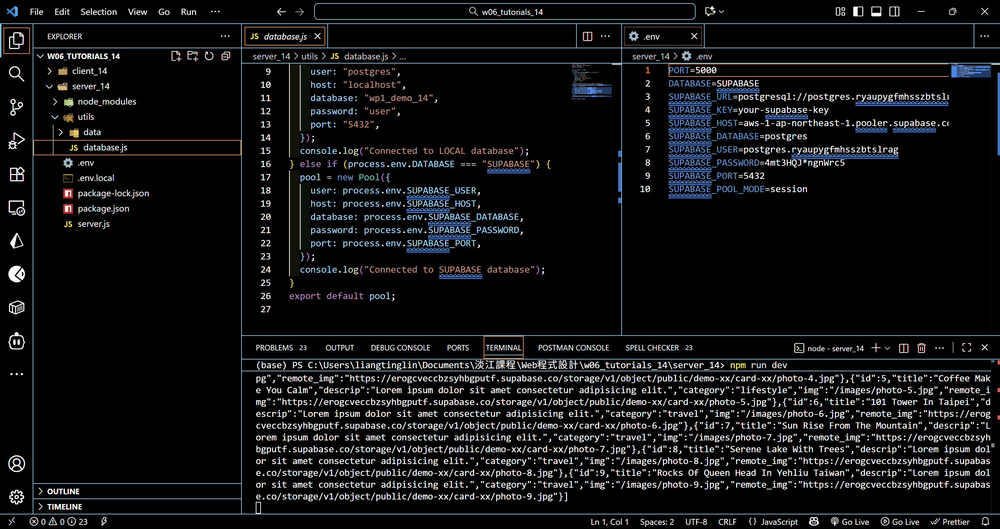
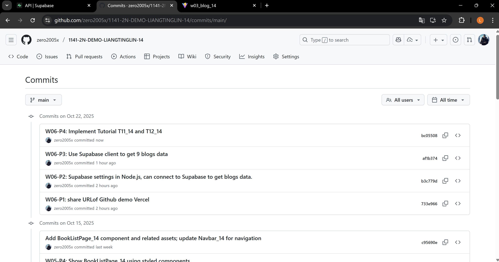

[Github URL](https://github.com/zero2005x/1141-2N-DEMO-LIANGTINGLIN-14)
[Github URL for Vercel](https://github.com/zero2005x/114_2N_demo_vercel_liangtinglin)
[Vercel URL](https://114-2-n-demo-vercel-liangtinglin.vercel.app/)

### W06-P1: share URLof Github demo Vercel



```
733e966 zero2005x       Wed Oct 22 19:12:56 2025 +0800  W06-P1: share URLof Github demo Vercel
```

### W06-P2: Supabase settings in Node.js, can connect to Supabase to get blogs data.

#### => able to get 9 blogs data in Supabase



#### => connect parameters in Supabase



#### => server code in Supabase setting



```
b3c779d zero2005x       Wed Oct 22 19:15:16 2025 +0800  W06-P2: Supabase settings in Node.js, can connect to Supabase to get blogs data.
```

### W06-P3: Use Supabase client to get 9 blogs data

#### => show API keys in Supabase


#### => Supabase client code


#### => Use BlogSupaPage_14.jsx to get blogs data from Supabase


```
af1b374 zero2005x       Wed Oct 22 20:08:52 2025 +0800  W06-P3: Use Supabase client to get 9 blogs data
```

### W06-P4: Implement Tutorial T11_14 and T12_14

#### => show code for T12_xx


#### => Chrome result


```

```

## W06-logs:



```

```
