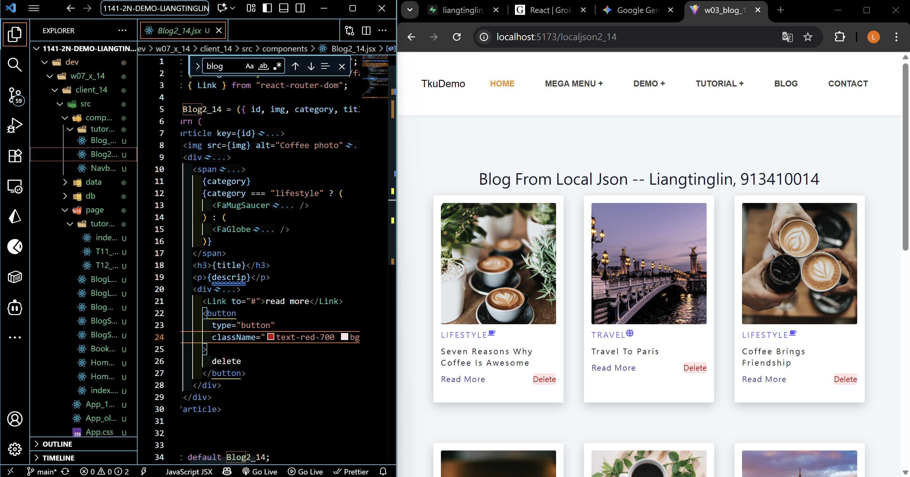
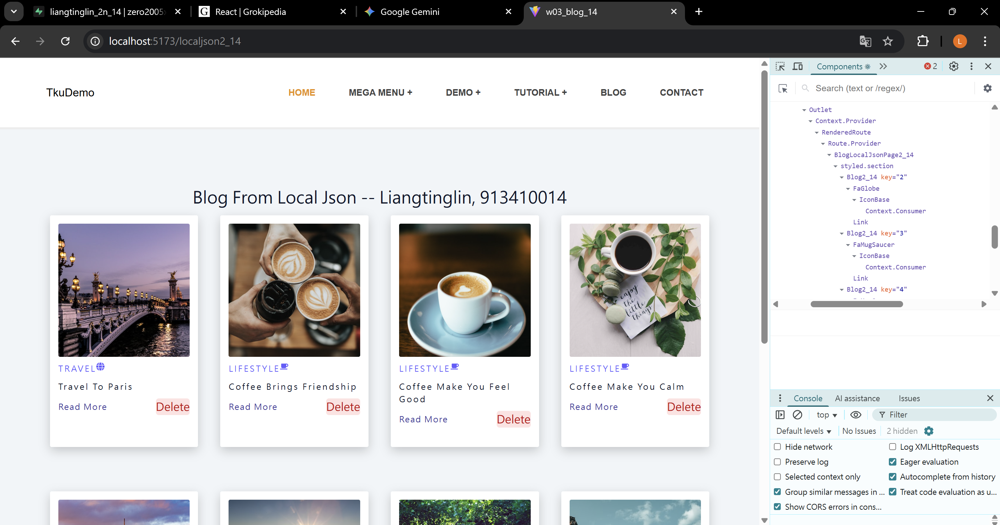
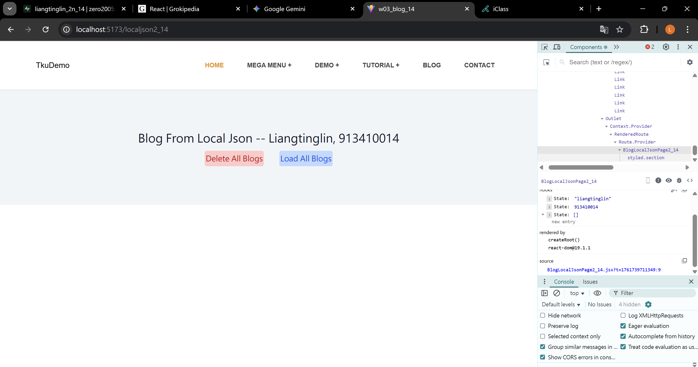
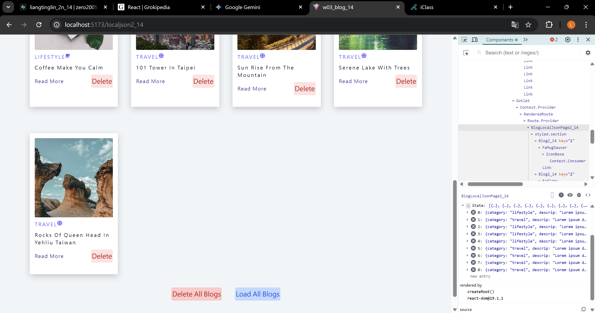
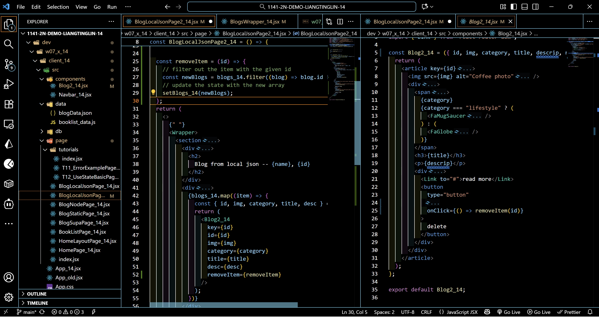
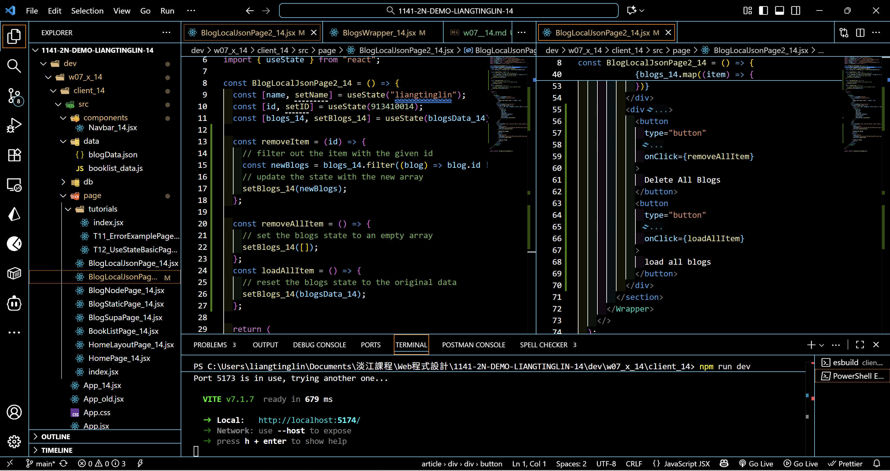
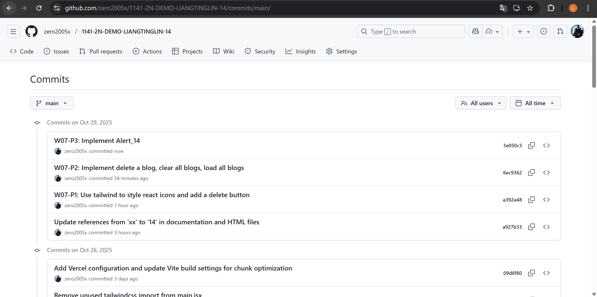

[Github URL](https://github.com/zero2005x/1141-2N-DEMO-LIANGTINGLIN-14)
[Github URL for Vercel](https://github.com/zero2005x/114_2N_demo_vercel_liangtinglin)
[Vercel URL](https://114-2-n-demo-vercel-liangtinglin.vercel.app/)

### W07-P1: Use tailwind to style react icons and add a delete button



```
a392a48 zero2005x       Wed Oct 29 19:27:54 2025 +0800  W07-P1: Use tailwind to style react icons and add a delete button
```

### W07-P2: Implement delete a blog, clear all blogs, load all blogs

#### => delete first blog



#### => clear all blogs



#### => load all blogs



#### => code for deleting a blog



#### => code for clear and load all blogs



```
6ec9362 zero2005x       Wed Oct 29 20:16:04 2025 +0800  W07-P2: Implement delete a blog, clear all blogs, load all blogs
```

### W07-P3: Implement Alert_14

#### => code for alert_14


```
3e050c3 zero2005x       Wed Oct 29 21:09:45 2025 +0800  W07-P3: Implement Alert_14
```

## W07-logs:



```

```
