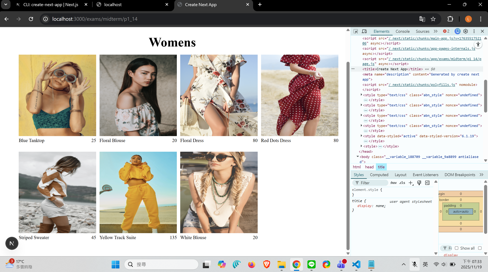
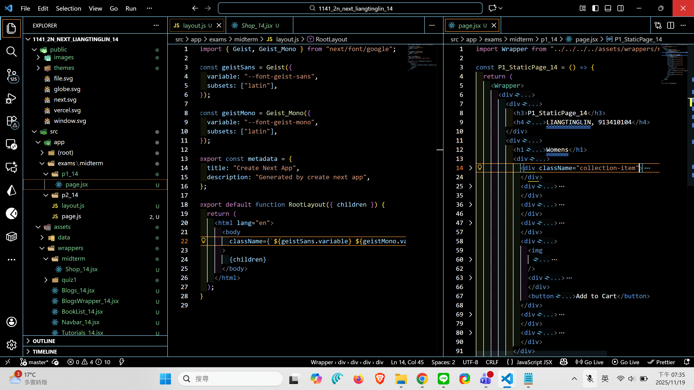
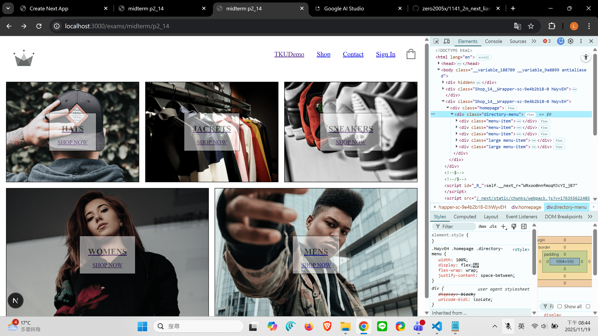
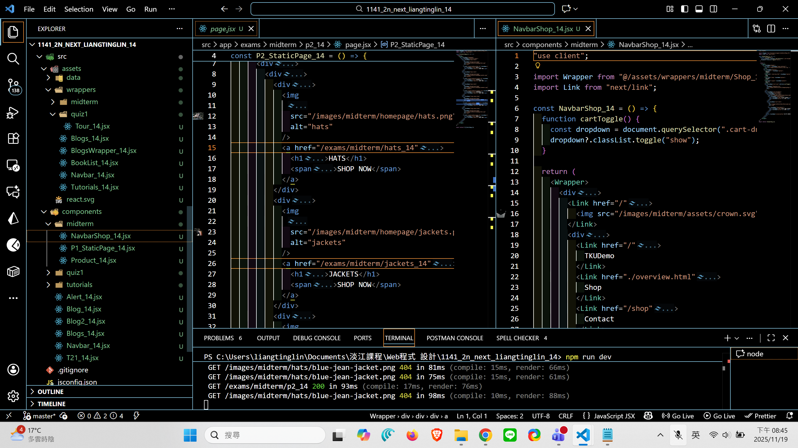
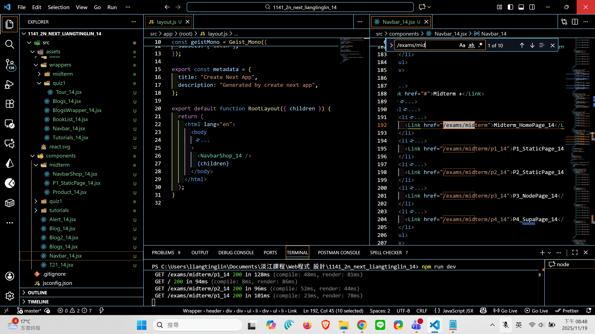
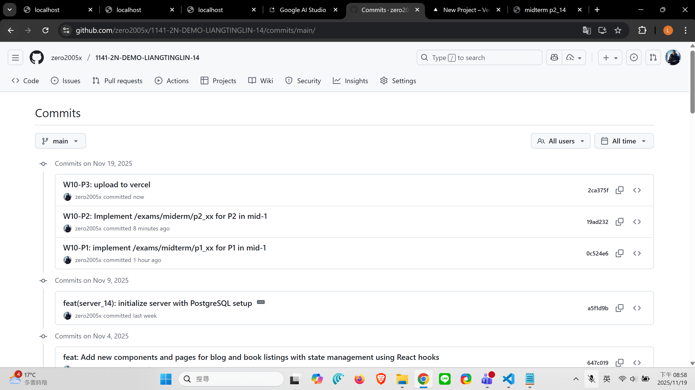

[Github URL](https://github.com/zero2005x/1141-2N-DEMO-LIANGTINGLIN-14)
[Github URL for Vercel](https://github.com/zero2005x/114_2N_demo_vercel_liangtinglin)
[Vercel URL](https://114-2-n-demo-vercel-liangtinglin.vercel.app/)

### W10-P1: implement /exams/midterm/p1_xx for P1 in mid-1

##### => Chrome, show P1 page with meta data



##### => show the relevant code



```
0c524e6 zero2005x       Wed Nov 19 19:37:45 2025 +0800  W10-P1: implement /exams/midterm/p1_xx for P1 in mid-1
```

### W10-P2: Implement /exams/miderm/p2_xx for P2 in mid-1

#### => shown in Chrome



#### => the relevant code for P2



#### => Navbar_xx for root layout



```

```

### W10-P3:

#### =>


```

```

## W10-logs:



```

```
