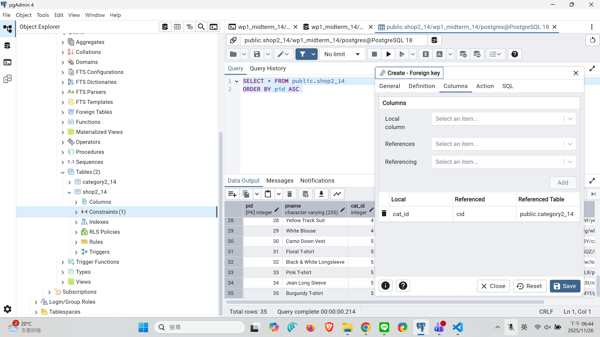
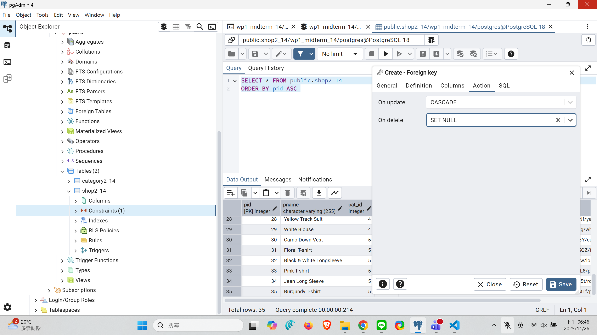
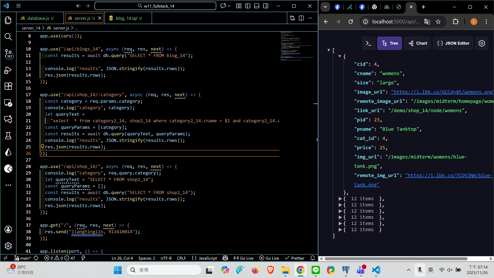
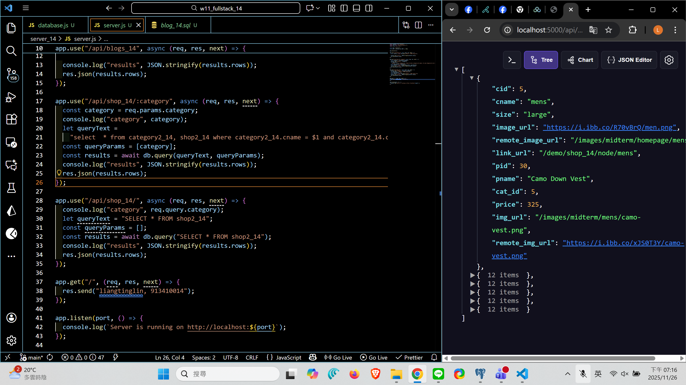
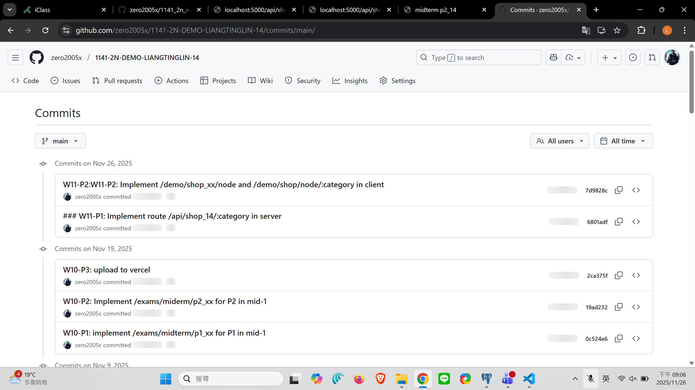

[Github URL](https://github.com/zero2005x/1141-2N-DEMO-LIANGTINGLIN-14)
[Github URL for Vercel](https://github.com/zero2005x/114_2N_demo_vercel_liangtinglin)
[Vercel URL](https://114-2-n-demo-vercel-liangtinglin.vercel.app/)

### W11-P1: Implement route /api/shop_14/:category in server

##### => create tables category2_14 and shop2_14 using SQL and set foreign key of cat_id referencing to cid in category2_14



##### => setup update and delete constraints of the foreign keys



##### => Chrome, show /api/shop_14/womens with code (use your my own id)



##### => Chrome, show /api/shop_14/ with code (use your my own id)



```

```

### W11-P2:

#### =>


#### =>


#### =>


```

```

### W11-P3:

#### =>


```

```

## W11-logs:



```

```
