[Github URL](https://github.com/zero2005x/1141-2N-DEMO-LIANGTINGLIN-14)
[Github URL for Vercel](https://github.com/zero2005x/114_2N_demo_vercel_liangtinglin)
[Vercel URL](https://114-2-n-demo-vercel-liangtinglin.vercel.app/)

### W12-P1: Refine code of /demo/shop_xx/node

##### =>

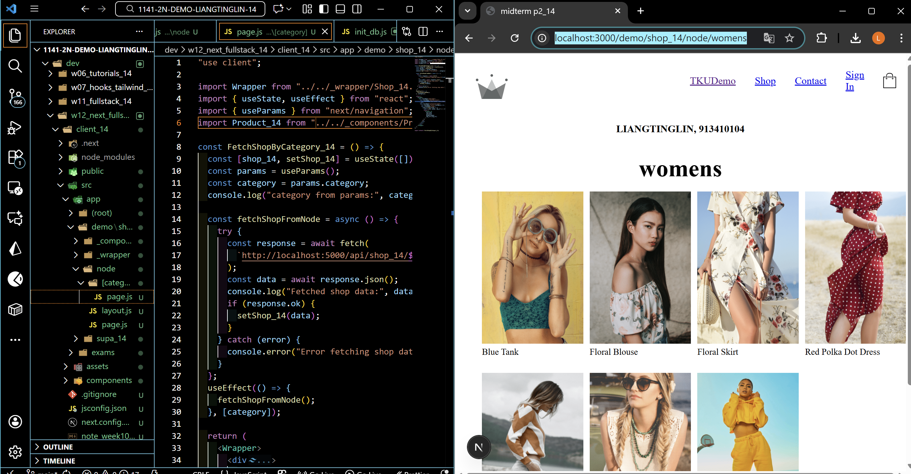

```
ce97f6f zero2005x       Wed Dec 3 19:03:27 2025 +0800   W12-P1: Refine code of /demo/shop_xx/node
```

### W12-P2: Deploy code to Vercel

#### => npm run build

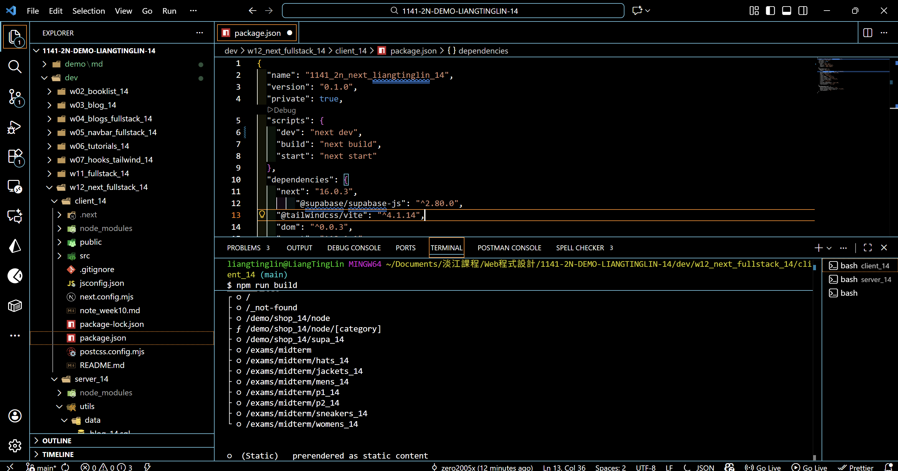

#### => npm start

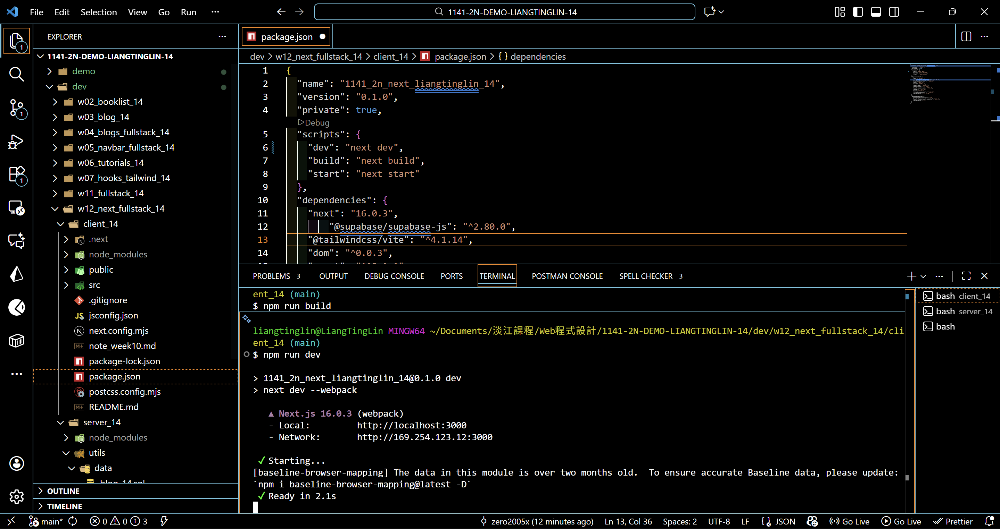

#### => Vercel, add environment variables

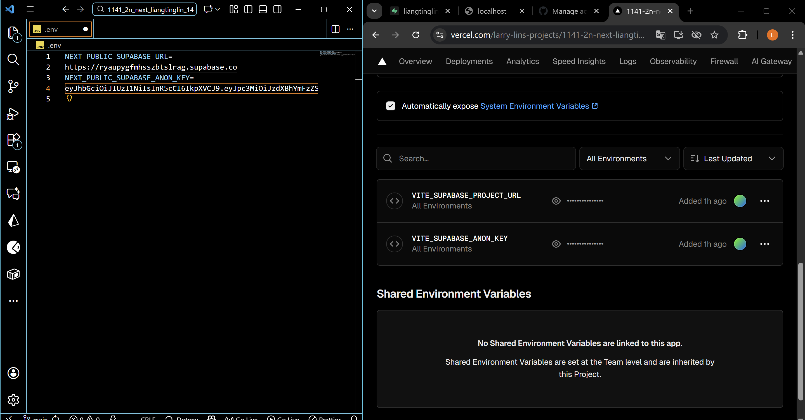

#### => Vercel homepage success

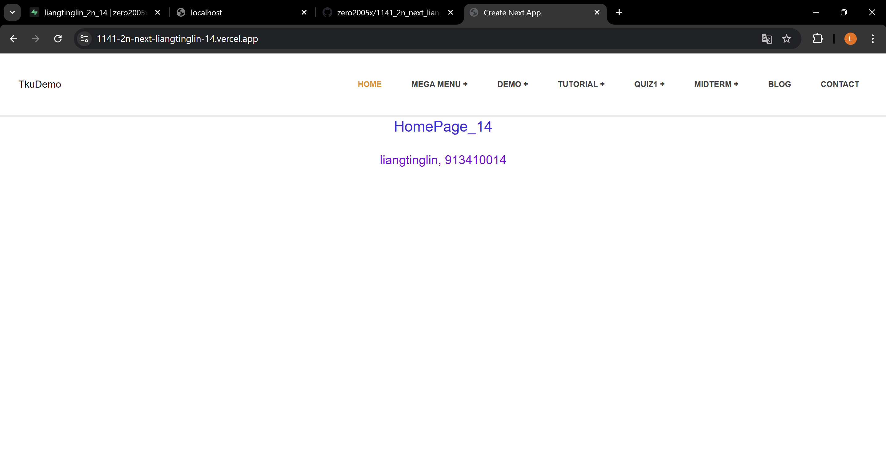

#### => Github repo and Vercel URL

[Gitbub Next URL](https://github.com/zero2005x/1141_2n_next_liangtinglin_14)
[Vercel Next URL](https://1141-2n-next-liangtinglin-14.vercel.app/)

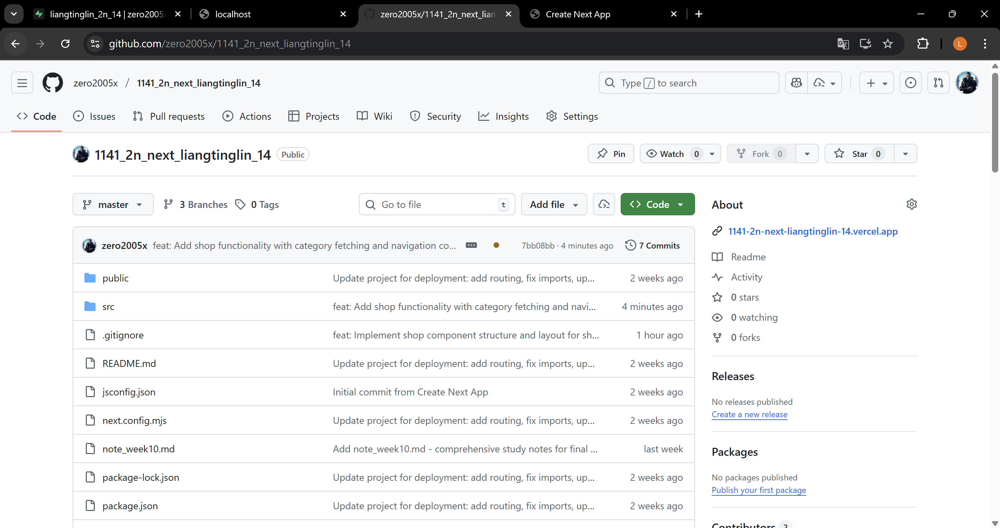

#### => Share to teacher and TA

htchung@gms.tku.edu.tw
sian-0018

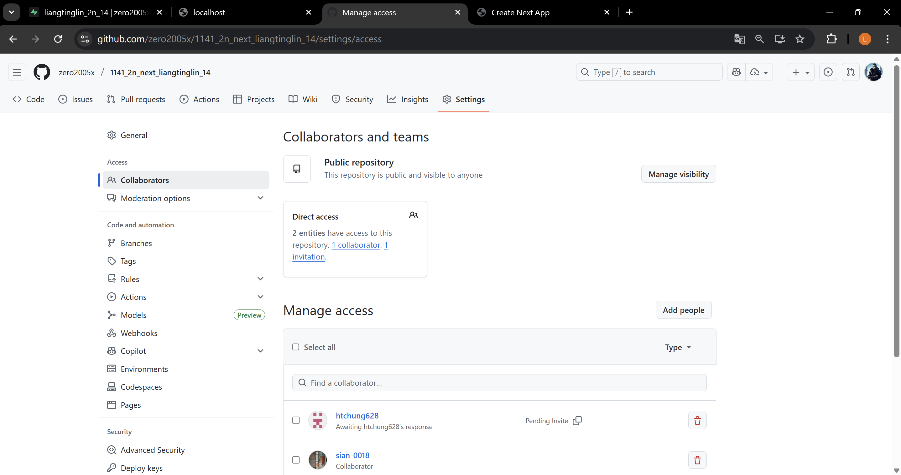

```

```

### W12-P3: Implenment /demo/shop2_xx/supabase to fetch products from Supabase

#### => use SQL to get category2_xx data

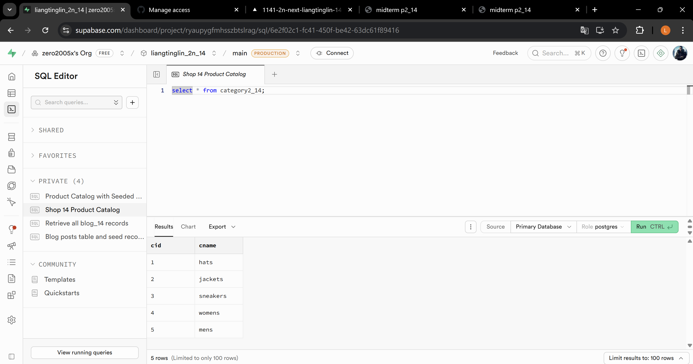

#### => use SQL to get shop2_xx data

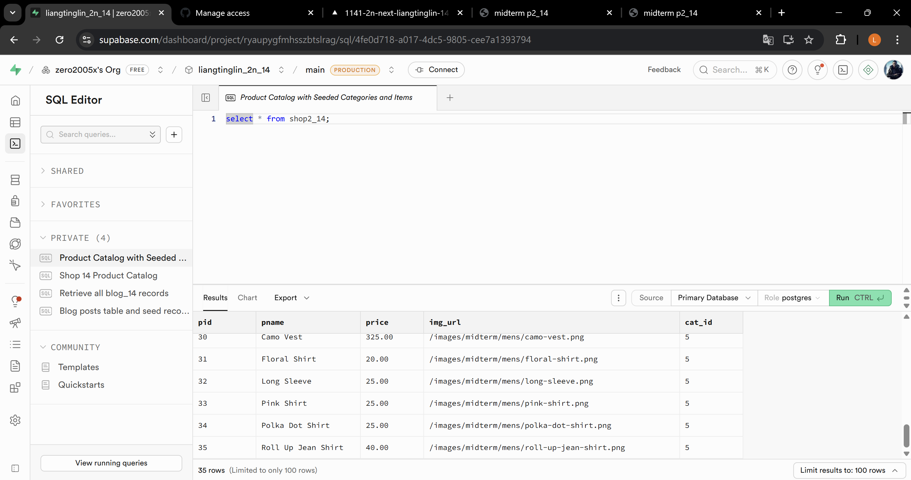

#### => set foreign key

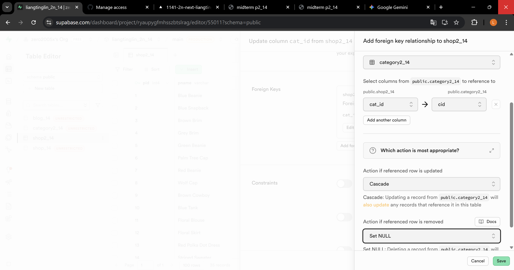

#### => set RLS policies for public access for all CRUD

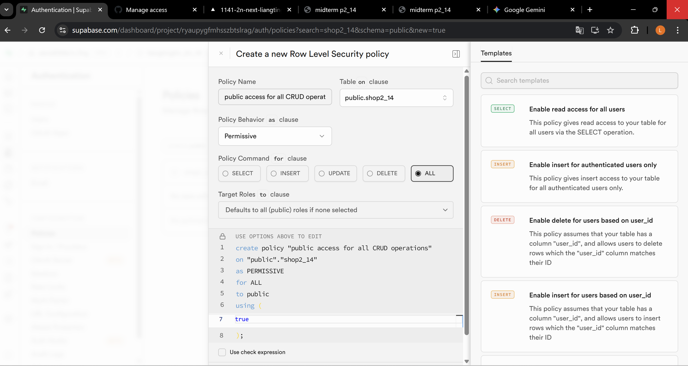

#### => Chrome -- local

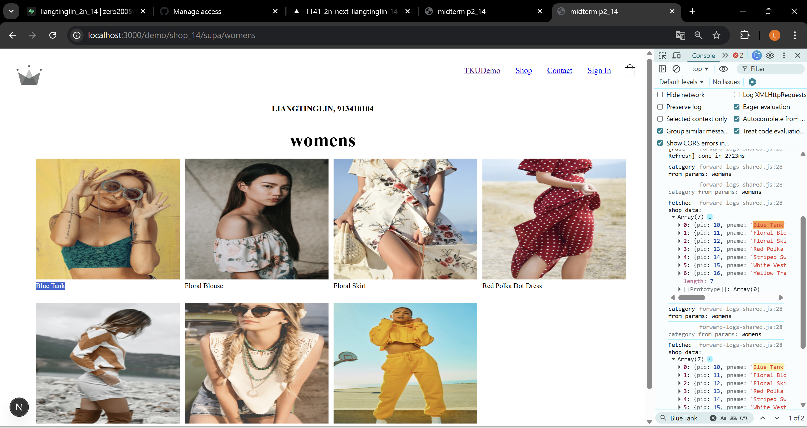

#### => Chrome -- Vercel

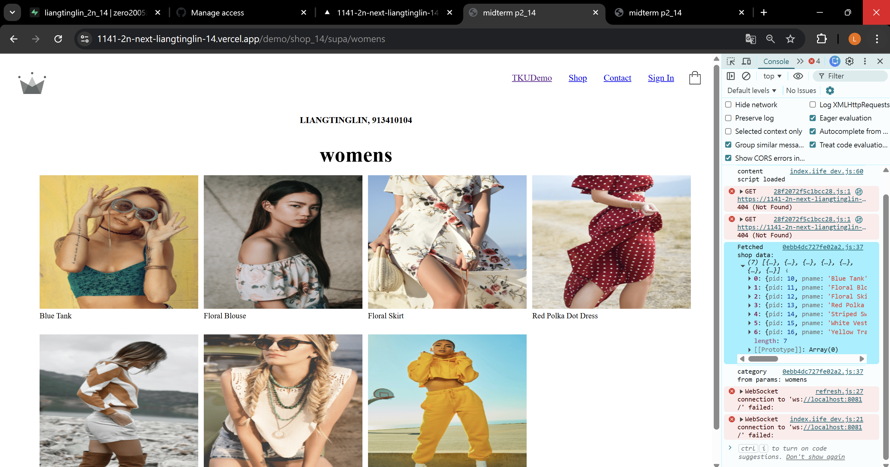

```

```

## W12-logs:

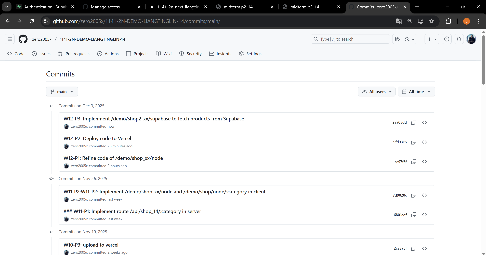

```

```
