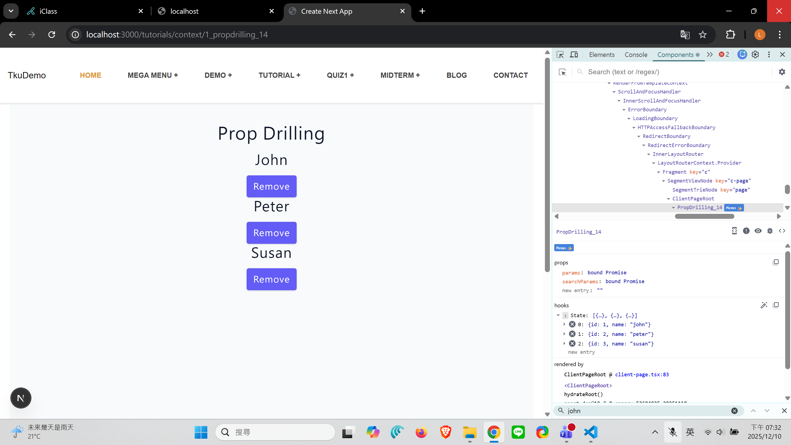
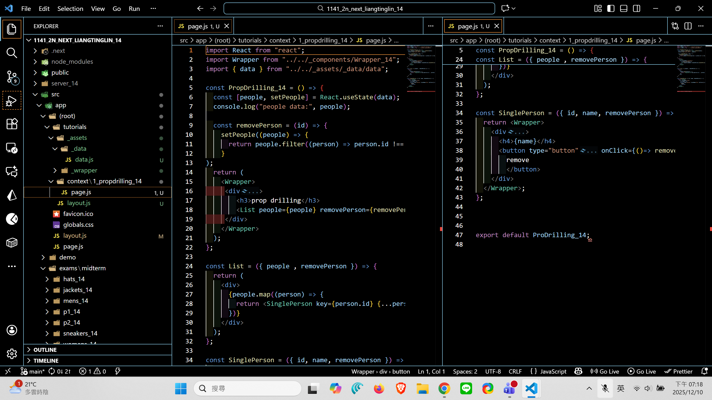
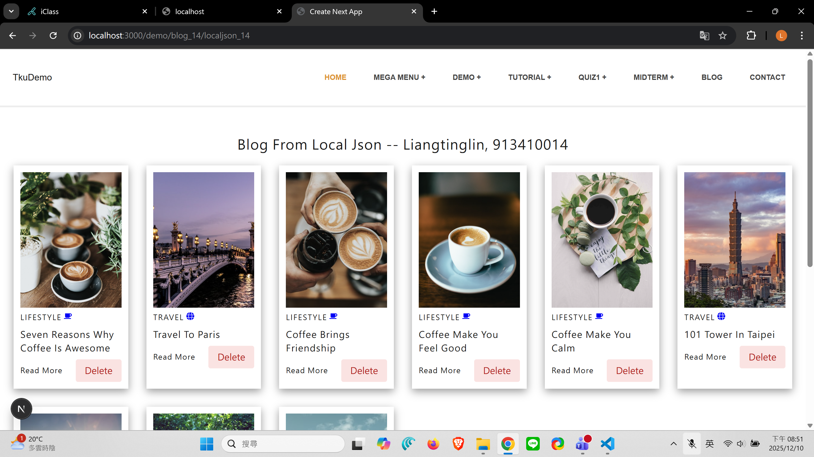
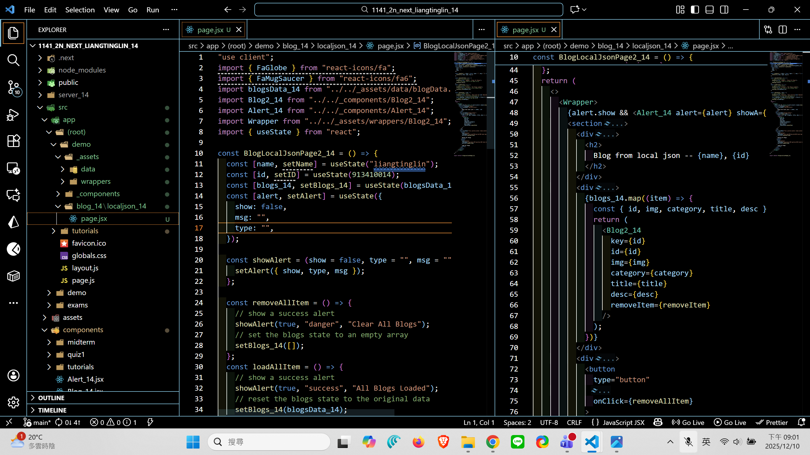
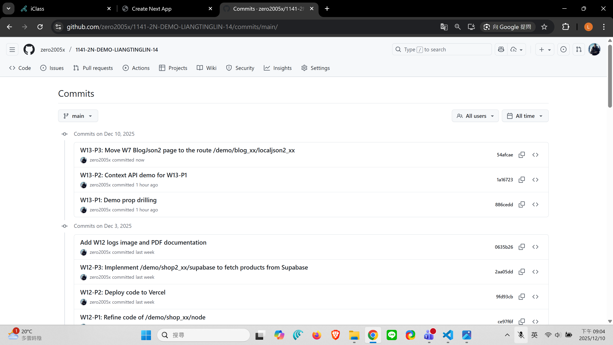

#### => Github repo and Vercel URL

[Github URL](https://github.com/zero2005x/1141-2N-DEMO-LIANGTINGLIN-14)
[Github URL for Vercel](https://github.com/zero2005x/114_2N_demo_vercel_liangtinglin)
[Vercel URL](https://114-2-n-demo-vercel-liangtinglin.vercel.app/)
[Gitbub Next URL](https://github.com/zero2005x/1141_2n_next_liangtinglin_14)
[Vercel Next URL](https://1141-2n-next-liangtinglin-14.vercel.app/)

### W13-P1: Demo prop drilling

#### => Chrome, remove 4th person



#### => relevant code



```
886cedd zero2005x       Wed Dec 10 19:34:16 2025 +0800  W13-P1: Demo prop drilling
```

### W13-P2: Context API demo for W13-P1

#### => Chrome, show PeopleContext.Provider by remove last person


#### => relevant code


```
1a16723 zero2005x       Wed Dec 10 20:02:07 2025 +0800  W13-P2: Context API demo for W13-P1
```

### W13-P3: Move W7 BlogJson2 page to the route /demo/blog_xx/localjson2_xx

#### => Chrome, show the result



#### => relevant code



```
54afcae zero2005x       Wed Dec 10 21:03:45 2025 +0800  W13-P3: Move W7 BlogJson2 page to the route /demo/blog_xx/localjson2_xx
```

## W13-logs:



```

```
