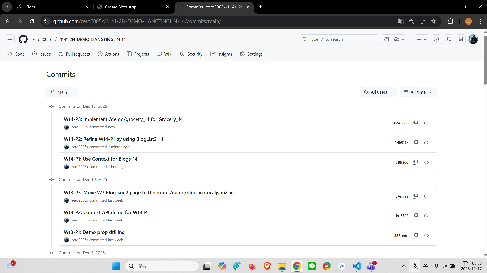

#### => Github repo and Vercel URL

[Github URL](https://github.com/zero2005x/1141-2N-DEMO-LIANGTINGLIN-14)
[Github URL for Vercel](https://github.com/zero2005x/114_2N_demo_vercel_liangtinglin)
[Vercel URL](https://114-2-n-demo-vercel-liangtinglin.vercel.app/)
[Gitbub Next URL](https://github.com/zero2005x/1141_2n_next_liangtinglin_14)
[Vercel Next URL](https://1141-2n-next-liangtinglin-14.vercel.app/)

### W14-P1: Use Context for Blogs_14

#### => Chrome, show blogs_xx in Content component


#### => relevant code


```
518f300 zero2005x       Wed Dec 17 19:45:28 2025 +0800  W14-P1: Use Context for Blogs_14
```

### W14-P2: Refine W14-P1 by using BlogList2_14

#### => Chrome, show BlogList2_xx, Blog2_xx component


#### => relevant code


```
9db917a zero2005x       Wed Dec 17 20:56:33 2025 +0800   W14-P2: Refine W14-P1 by using BlogList2_14
```

### W14-P3: Implement /demo/grocery_14 for Grocery_14

#### => Chrome, add two data, and show in components


#### => relevant code


```
0245686 zero2005x       Wed Dec 17 20:57:51 2025 +0800  W14-P3: Implement /demo/grocery_14 for Grocery_14
```

## W14-logs:



```

```
