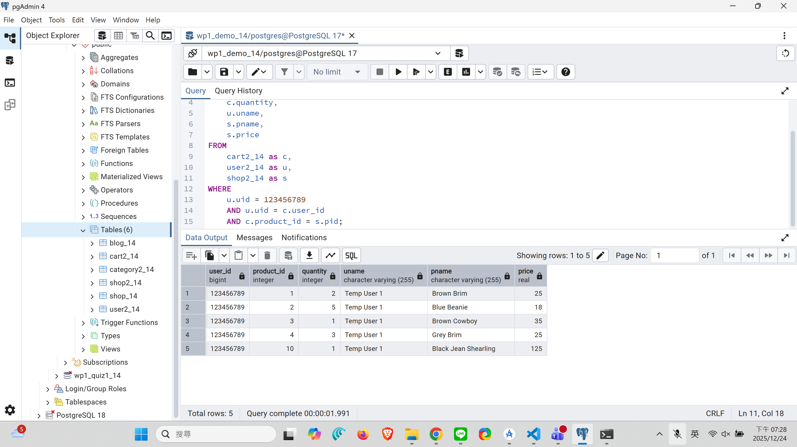
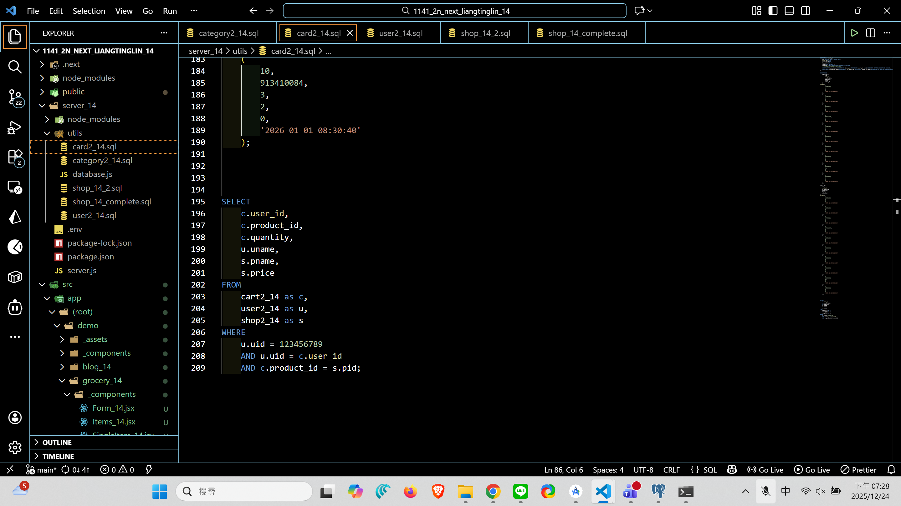
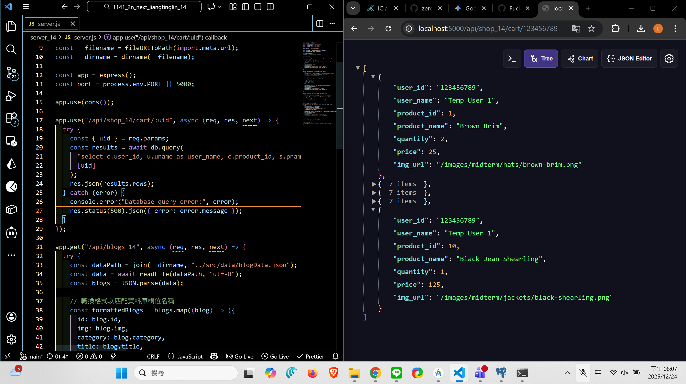
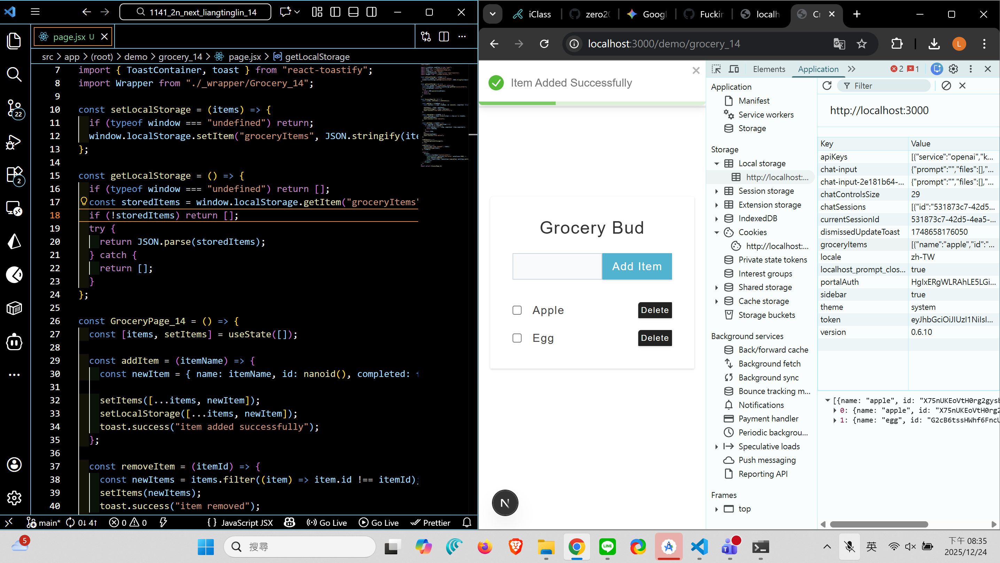
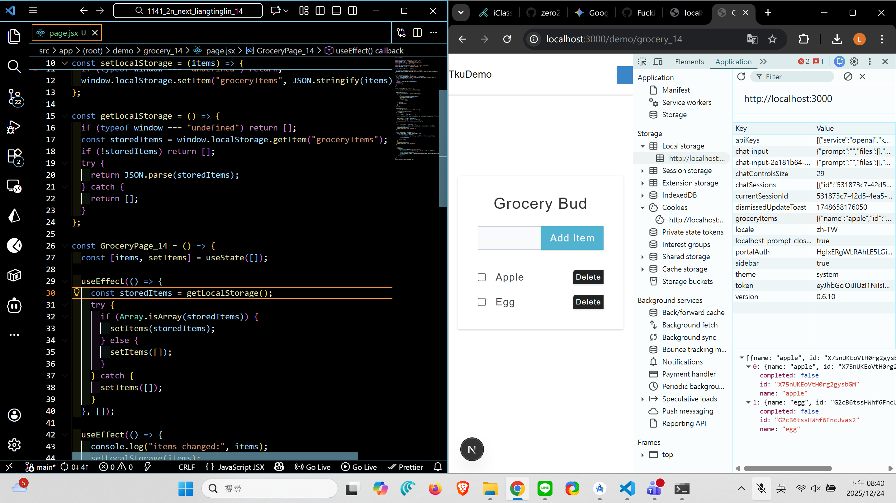

#### => Github repo and Vercel URL

[Github URL](https://github.com/zero2005x/1141-2N-DEMO-LIANGTINGLIN-14)
[Github URL for Vercel](https://github.com/zero2005x/114_2N_demo_vercel_liangtinglin)
[Vercel URL](https://114-2-n-demo-vercel-liangtinglin.vercel.app/)
[Gitbub Next URL](https://github.com/zero2005x/1141_2n_next_liangtinglin_14)
[Vercel Next URL](https://1141-2n-next-liangtinglin-14.vercel.app/)

### W15-P1: Create tables category2_xx, shop2_xx, user2_xx, cart2_xx, and put 5 products into a cart for the user of your id

#### => pgAdmin4, show SQL command to get the needed info



#### => sql code



```
f633623 zero2005x       Wed Dec 24 19:45:11 2025 +0800  W15-P1: Create tables category2_xx, shop2_xx, user2_xx, cart2_xx, and put 5 products into a cart for the user of your id
```

### W15-P2: Implement route /api/shop_xx/cart/:uid to get the info as the SQL in W15-P1



```
fc637f1 zero2005x       Wed Dec 24 20:12:56 2025 +0800  W15-P2: Implement route /api/shop_xx/cart/:uid to get the info as the SQL in W15-P1
```

### W15-P3: Use localStorage

#### => Implement setLocalStorage



#### => Implement getLocalStorage



```

```

## W15-logs:


```

```
