# (100%) Web 程式設計一 小考 1 -- 斷網考試

##### 2025-11-4, at E201

#### Note:

1. 請不要發揮同學愛，作弊雙方除了本次考試 0 分外，平常分數另扣 20 分，情節嚴重者會送校。
2. iClass 上請繳交 quiz1_14.pdf，還有 md_quiz1_14.zip, client_14.zip, server_14.zip 四個壓縮檔，壓縮前請將 node_modules 全部砍掉，如果 client_14.zip 檔案過大，請砍掉 public 下的 images 檔。
3. 請直接將答案寫在 md_quiz1_14/quiz1_14.md 上，老師出題及圖片放在 quiz1_htc.pdf 上，請依照老師所給的圖片來實作並標註
4. 跟小考相關的檔案及目錄名稱有 xx 時，必須要改成學號後 2 碼，沒有修改時，會視違犯情況扣分。
5. 每一張圖片要有機房左側背景，圖片上要有你的學號(或後兩碼)，圖片標註要跟老師所標註的類似。違者會依情節扣分。
6. 請自評分數，將每一題的 ? 填入分數，沒有填者，不會批改，以 0 分計算。

##### Your (Name, ID): (林亮廷 , 913410014)

- P1 (15%): 15 分
- P2 (30%): 30 分
- P3 (20%): 20 分
- P4 (35%): 35 分

##### 總分: 80 分

---

NOTE: 本次小考請根據老師提供的 tour theme，來實作，放在 public/themes/quiz1 目錄下。

P1, P2 兩題之路由可以直接從網址列輸入及測試
P3, P4 要可以從 TKUdemo 之 Quiz1 選單中選取執行，並且 TKUdemo 與 Quiz1 選單可以互相切換執行

#### (15%) P1: 請實作路由 /quiz1/static_14，顯示 4 筆 featured tours 資訊

##### => 將 theme 中的 tours 部分放入 pages/quiz1/TourStaticPage_14.jsx 中，並得到如下的結果

##### => 顯示 TourStaticPage_14.jsx 主要的 code，請縮排成如上圖般顯示

#### Your Answer

##### => 將 theme 中的 tours 部分放入 pages/quiz1/TourStaticPage_14.jsx 中，並得到如下的結果

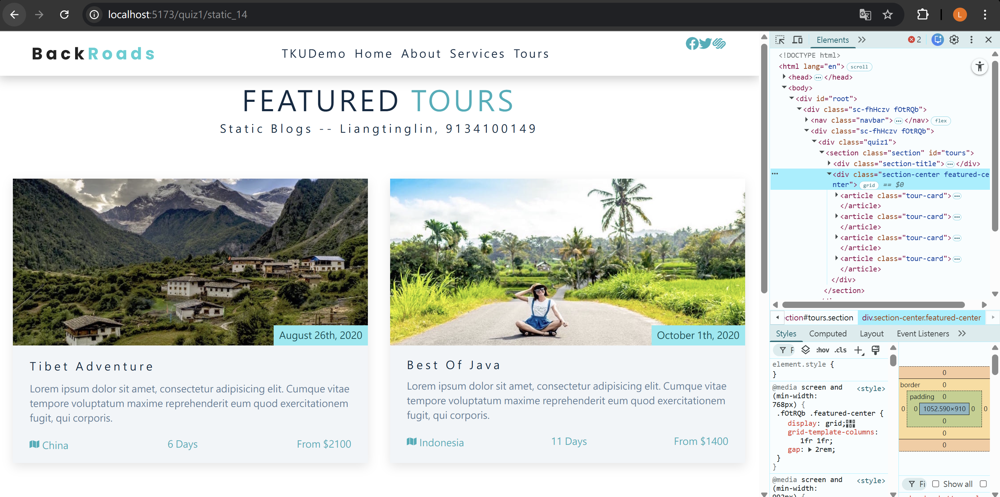

##### => 顯示 ourStaticPage_14.jsx 主要的 code，請縮排成如上圖般顯示

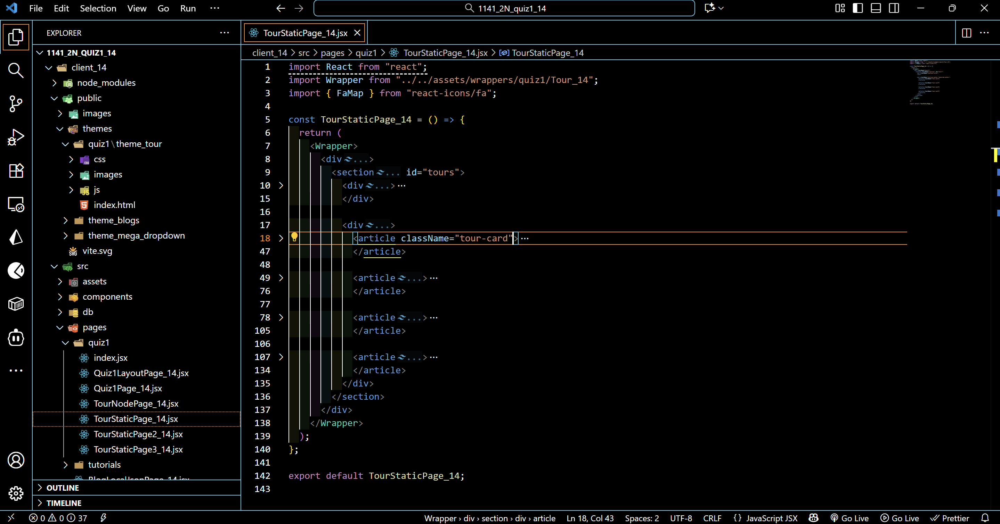

---

#### (30%) P2: 請實作路由 /quiz1/static2_14，顯示 Tour theme 全部資訊

##### => Chrome 顯示 navbar 及 hero section 資訊

##### => Chrome 顯示 about section 資訊

##### => Chrome 顯示 services section 資訊

##### => Chrome 顯示 tours section 資訊

##### => Chrome 顯示 footer section 資訊

##### => 顯示 TourStaticPage2_14.jsx 主要的 code，請縮排如下

##### => 顯示 App_14.jsx 選單 code

P1, P2 兩題之路由直接從網址列輸入即可
P3, P4 要可以從 TKUdemo 之 Quiz1 選單中選取執行，並且 TKUdemo 與 Quiz1 選單可以互相切換執行

#### Your Answer

##### => Chrome 顯示 navbar 及 hero section 資訊

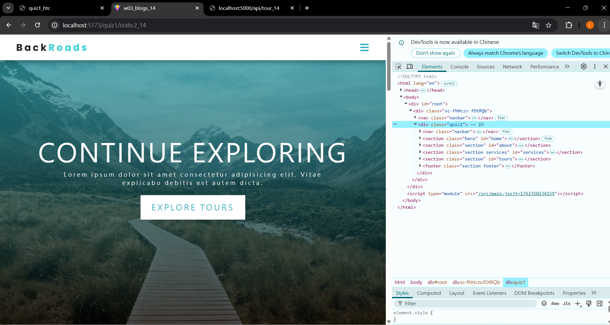

##### => Chrome 顯示 about section 資訊

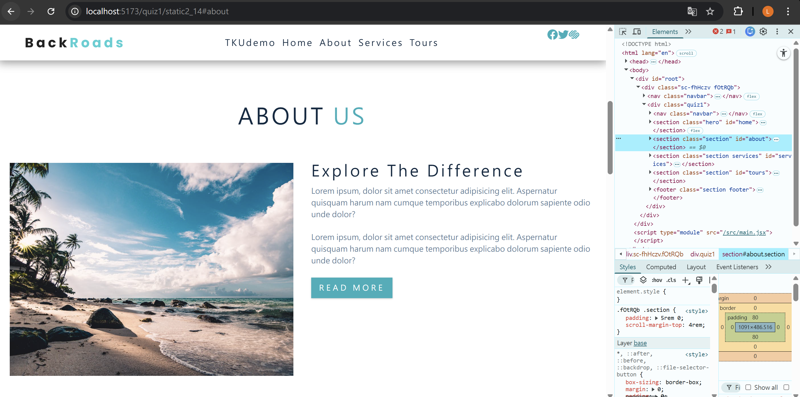

##### => Chrome 顯示 services section 資訊

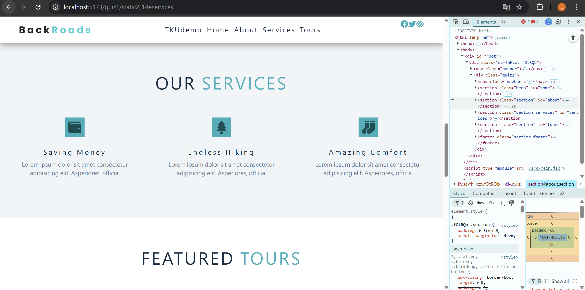

##### => Chrome 顯示 tours section 資訊

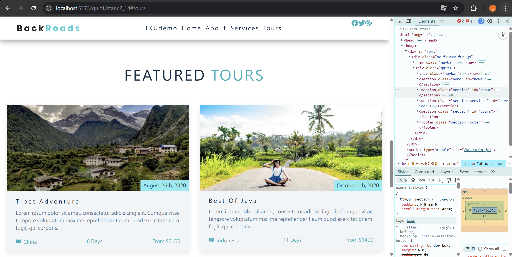

##### => Chrome 顯示 footer section 資訊

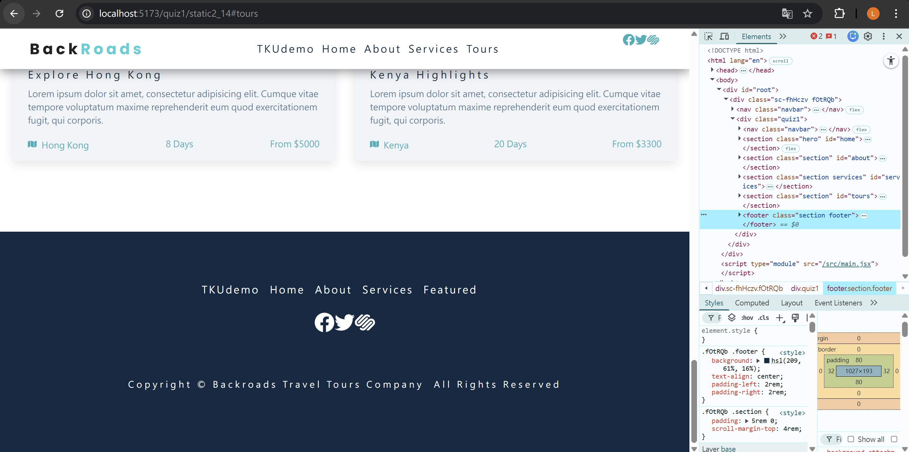

##### => 顯示 TourStaticPage2_14.jsx 主要的 code，請縮排如下

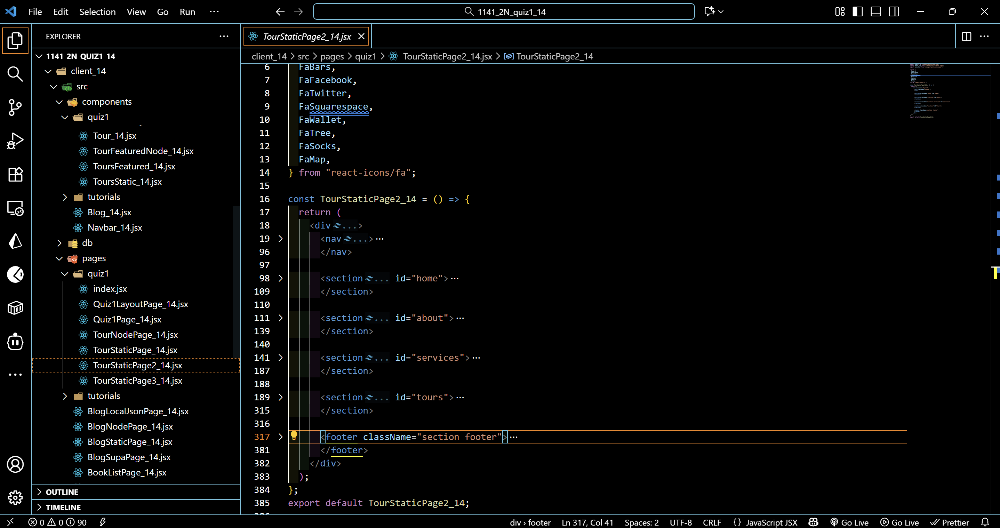

##### => 顯示 App_14.jsx 選單 相關之 code

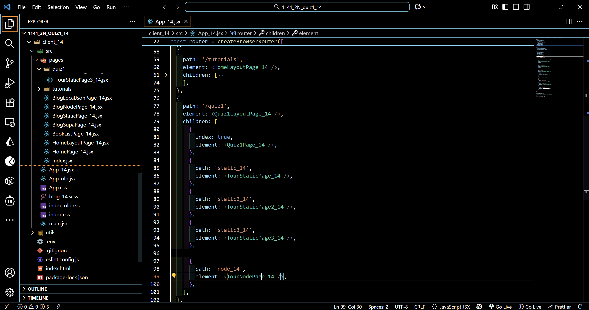

---

#### (20%) 請實作路由 /quiz1/static3_14，將每個不同 section 的資訊放入不同的 components 中，並能顯示全部資訊，並要能切換 TKUdemo 與 Quiz1 之選單

##### => 目錄檔案結構如下圖

##### => Chrome 顯示所有用到的 components 資訊，要透過 DevTools 中之 components 來顯示

##### => Chrome DevTools components，點選 TourStatic_14 的顯示截圖

##### => 顯示 TKUdemo Quiz1 選單，裡面有本次 quiz1 之四題，點選 TourStaticPage3_14，可以執行本次考試的 P3

##### => TKUdemo Quiz1 選單，相對應的 code

#### Your Answer

##### => Chrome 顯示所有用到的 components 資訊，要透過 DevTools 中之 components 來顯示

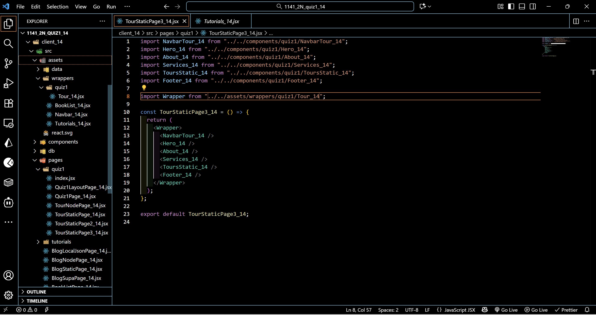

##### => Chrome DevTools components，點選 TourStatic_14 的顯示截圖

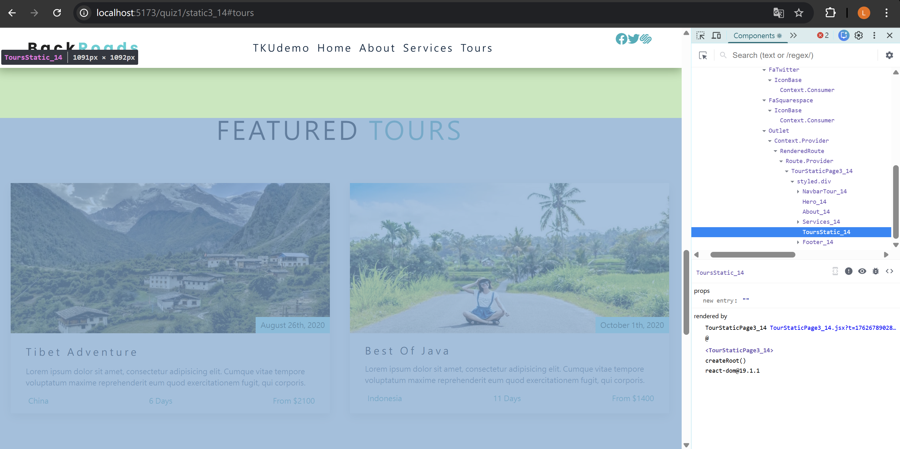

##### => 顯示 App_14.jsx 本題的相關 code

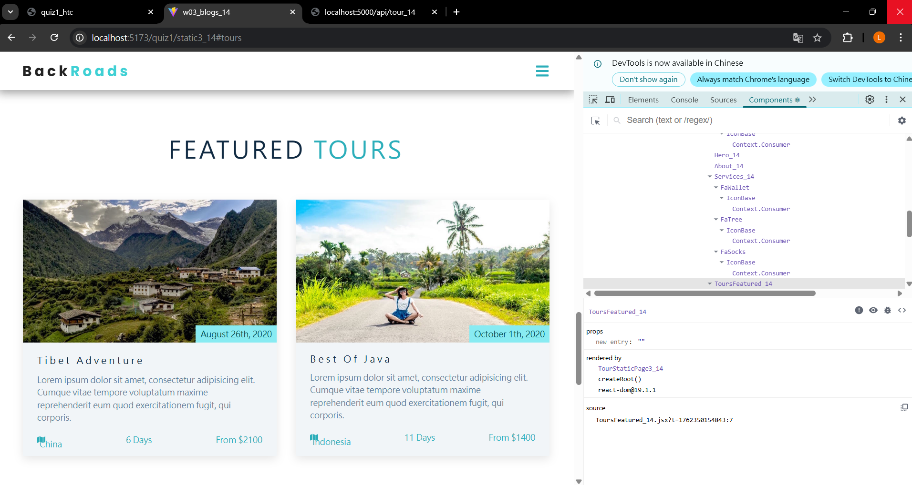

##### => 顯示 TKUdemo Quiz1 選單，裡面有本次 quiz1 之四題，點選 TourStaticPage3_14，可以執行本次考試的 P3

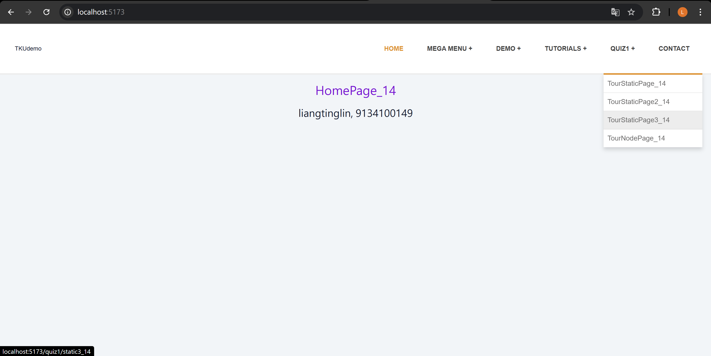

##### => TKUdemo Quiz1 選單，相對應的 code

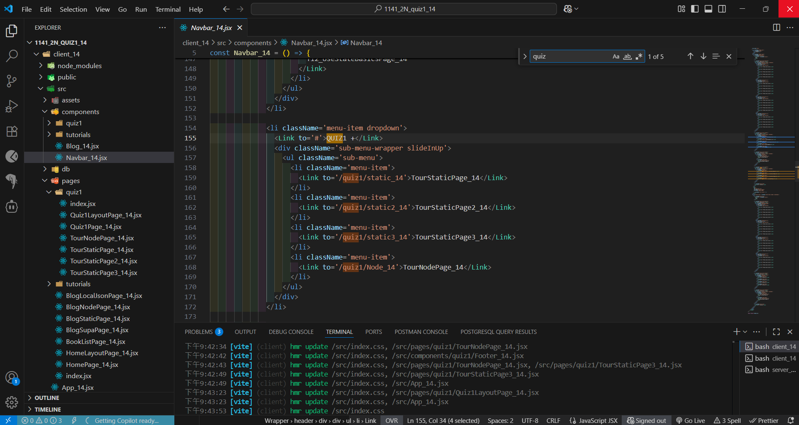

##### => 顯示 code，如何從 Quiz1 之 TKUdemo 選項連回 TKUdemo

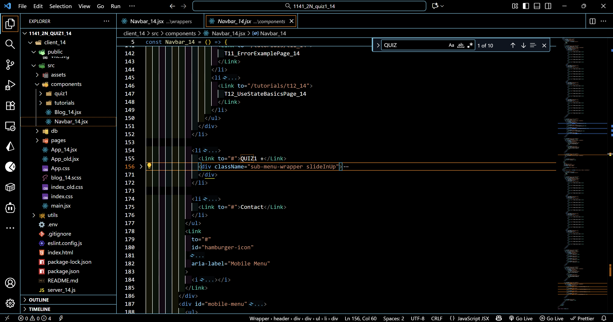

---

#### (35%) P4: 將四筆 featured tour 資訊透過 pgAdmin 放入 PostgreSQL server 中，前端可以透過 /api/tour_14 呼叫取得這四筆資料，套用在前端

配分：後端 20%; 前端 15%

##### => 請透過 pgAdmin 產生資料庫 wp1_quiz1_14，並透過 SQL 指令產生四筆 featured tour 資訊，如下圖， tour_14 table 之欄位請以圖中所表示，其中 featured 表示是否為 featured products。

.env 設定
DATABASE=LOCAL

##### => 透過 /api/tour_14/featured 可以取得 featured products

##### => client 端，透過路由 /quiz1/node_14 從 server 端取得 featured tours 資訊

##### => client 端目錄結構，TourFeatured_14.js 顯示多個 featured tours，每一個 tour 必須透過 Tour_14.js 來顯示。

#### Your Answer

##### => 請透過 pgAdmin 產生資料庫 wp1_quiz1_14，並透過 SQL 指令產生四筆 featured tour 資訊，如下圖， tour_14 table 之欄位請以圖中所表示，其中 featured 表示是否為 featured products。

.env 設定
DATABASE=LOCAL

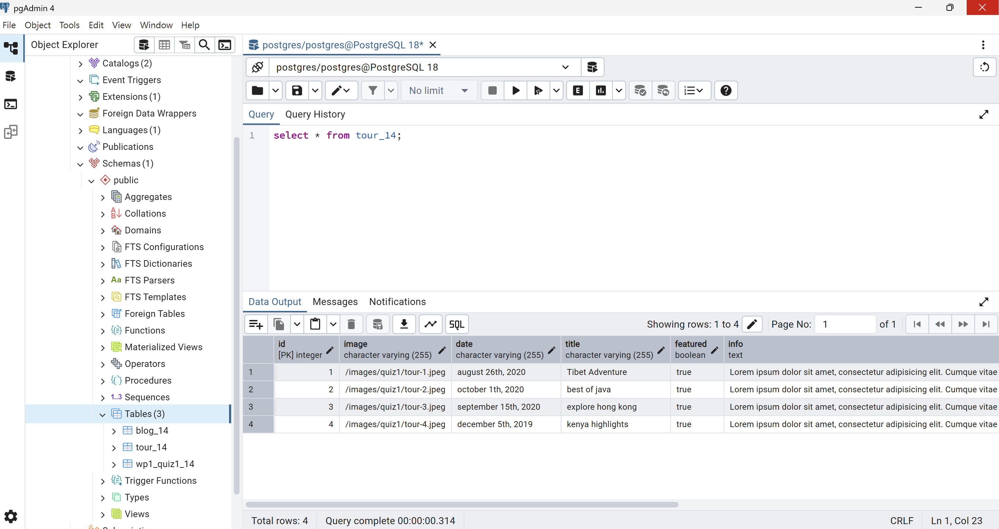

##### => 透過 /api/tour_14/featured 可以取得 featured products

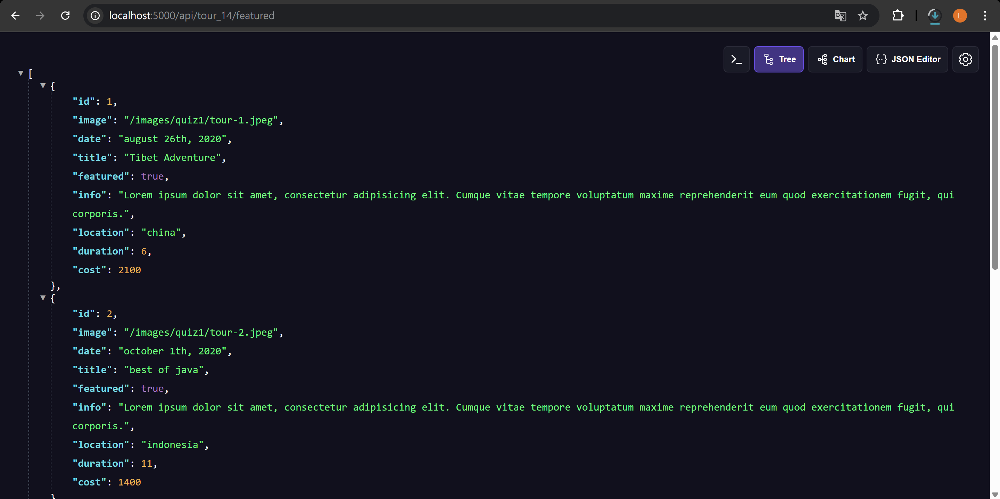

##### => 顯示 server_14.js 及 utils/database.js 相關設定

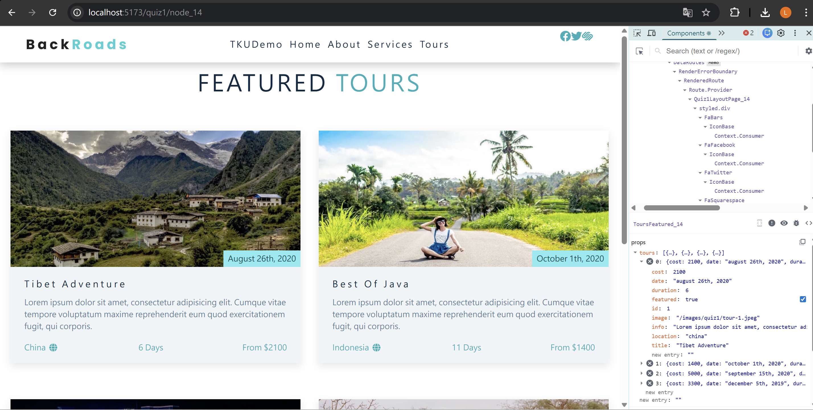

##### => client 端，透過路由 /quiz1/node_14 從 server 端取得 featured tours 資訊

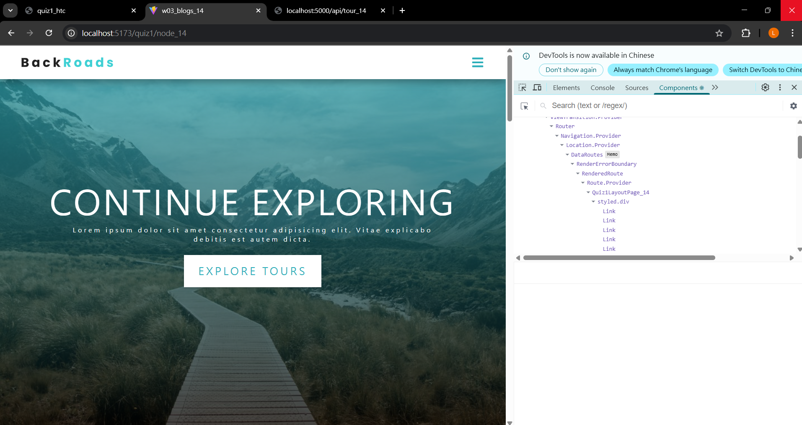

##### => TourFeatured_14.js 相關 code

##### => Tour_14.js 相關 code

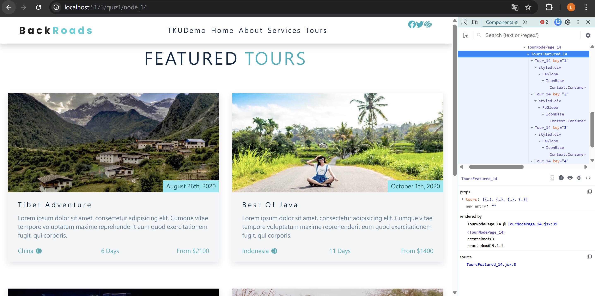
